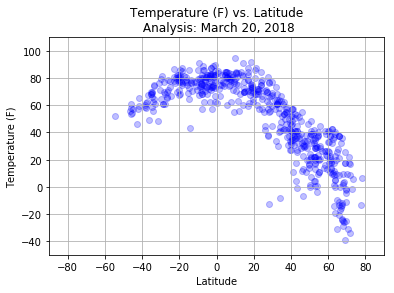
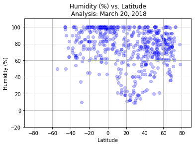
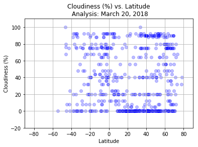
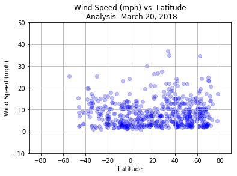

```python
# Dependencies
import pandas as pd
import matplotlib.pyplot as plt
import numpy as np
import requests
from random import uniform
import time
from citipy import citipy

# Retrieve API key
from config import api_key

# Read world cities csv from citipy
weather_cities = pd.read_csv("worldcities.csv")

weather_cities.head()
```


<div>
<style>
    .dataframe thead tr:only-child th {
        text-align: right;
    }

    .dataframe thead th {
        text-align: left;
    }

    .dataframe tbody tr th {
        vertical-align: top;
    }
</style>
<table border="1" class="dataframe">
  <thead>
    <tr style="text-align: right;">
      <th></th>
      <th>Country</th>
      <th>City</th>
      <th>Latitude</th>
      <th>Longitude</th>
    </tr>
  </thead>
  <tbody>
    <tr>
      <th>0</th>
      <td>ad</td>
      <td>andorra la vella</td>
      <td>42.500000</td>
      <td>1.516667</td>
    </tr>
    <tr>
      <th>1</th>
      <td>ad</td>
      <td>canillo</td>
      <td>42.566667</td>
      <td>1.600000</td>
    </tr>
    <tr>
      <th>2</th>
      <td>ad</td>
      <td>encamp</td>
      <td>42.533333</td>
      <td>1.583333</td>
    </tr>
    <tr>
      <th>3</th>
      <td>ad</td>
      <td>la massana</td>
      <td>42.550000</td>
      <td>1.516667</td>
    </tr>
    <tr>
      <th>4</th>
      <td>ad</td>
      <td>les escaldes</td>
      <td>42.500000</td>
      <td>1.533333</td>
    </tr>
  </tbody>
</table>
</div>


```python
# Generate random lat/long numbers
lat_sample = [np.random.uniform(-90,90) for x in range(2000)]
lng_sample = [np.random.uniform(-180, 180) for x in range(2000)]

# Create datafrom for random lat/long numbers
closest_cities_df = pd.DataFrame()
closest_cities_df["rand_lat"] = lat_sample
closest_cities_df["rand_lng"] = lng_sample

# Obtain closest cities to random lat/long numbers using citipy package
for index, row in closest_cities_df.iterrows():
    lat = row["rand_lat"]
    lng = row["rand_lng"]
    
    city = citipy.nearest_city(lat, lng)
    city_name = city.city_name
    country_code = city.country_code
    
    closest_cities_df.set_value(index, "closest_country", country_code)
    closest_cities_df.set_value(index, "closest_city", city_name)
    
closest_cities_df.head()
```


<div>
<style>
    .dataframe thead tr:only-child th {
        text-align: right;
    }

    .dataframe thead th {
        text-align: left;
    }

    .dataframe tbody tr th {
        vertical-align: top;
    }
</style>
<table border="1" class="dataframe">
  <thead>
    <tr style="text-align: right;">
      <th></th>
      <th>rand_lat</th>
      <th>rand_lng</th>
      <th>closest_country</th>
      <th>closest_city</th>
    </tr>
  </thead>
  <tbody>
    <tr>
      <th>0</th>
      <td>50.780075</td>
      <td>-78.807672</td>
      <td>ca</td>
      <td>matagami</td>
    </tr>
    <tr>
      <th>1</th>
      <td>-69.159507</td>
      <td>46.750820</td>
      <td>za</td>
      <td>port alfred</td>
    </tr>
    <tr>
      <th>2</th>
      <td>22.410180</td>
      <td>110.684326</td>
      <td>cn</td>
      <td>dongzhen</td>
    </tr>
    <tr>
      <th>3</th>
      <td>-30.818891</td>
      <td>133.022722</td>
      <td>au</td>
      <td>flinders</td>
    </tr>
    <tr>
      <th>4</th>
      <td>-48.224299</td>
      <td>-39.407601</td>
      <td>uy</td>
      <td>chuy</td>
    </tr>
  </tbody>
</table>
</div>


```python
# Check for unique number of cities
closest_cities_df["closest_city"].nunique()
```


    754


```python
# Drop duplicate cities
closest_cities_df = closest_cities_df.drop_duplicates(["closest_city"])
```


```python
# Double check count of each city
closest_cities_df["closest_city"].value_counts()
```


    stornoway                1
    verkhnyaya inta          1
    upington                 1
    ponta do sol             1
    samusu                   1
    alotau                   1
    clyde river              1
    tura                     1
    sao filipe               1
    pilar                    1
    seddon                   1
    glomfjord                1
    hihifo                   1
    zalantun                 1
    bilibino                 1
    cooma                    1
    los llanos de aridane    1
    adeje                    1
    iqaluit                  1
    pacific grove            1
    marcona                  1
    conceicao da barra       1
    saint stephen            1
    trincomalee              1
    black river              1
    louisbourg               1
    acapulco                 1
    ahipara                  1
    antipovka                1
    barcelos                 1
                            ..
    katsuura                 1
    kidal                    1
    faya                     1
    kathmandu                1
    nome                     1
    lakhdenpokhya            1
    biloela                  1
    victoria                 1
    isangel                  1
    morada nova              1
    san angelo               1
    scarborough              1
    malanje                  1
    cerrito                  1
    la ronge                 1
    nizhneyansk              1
    strezhevoy               1
    pangai                   1
    mezen                    1
    misratah                 1
    sola                     1
    porto walter             1
    castro                   1
    palabuhanratu            1
    iquique                  1
    ingham                   1
    toora-khem               1
    sacramento               1
    vermilion                1
    beyneu                   1
    Name: closest_city, Length: 754, dtype: int64


```python
# Check count of dataframe
closest_cities_df.count()
```


    rand_lat           754
    rand_lng           754
    closest_country    754
    closest_city       754
    dtype: int64


```python
# Open Weather API url

url = "http://api.openweathermap.org/data/2.5/weather?q="
units = "imperial"

# Set count variable for print log
count = 1

# Create new dataframe for needed data
select_cities_df = pd.DataFrame()

# Loop through closest cities
for index, row in closest_cities_df.iterrows():
    time.sleep(0.5)
    city_sample = row["closest_city"]
    city_sample_join = "".join(city_sample.split())
    country_sample = row["closest_country"]
    query_url = url + city_sample_join + "," + country_sample + "&units=" + units + "&appid=" + api_key
    
    # Obtain and append needed data to dataframe
    try:
        cities_response = requests.get(query_url)
        cities_json = cities_response.json()
        
        latitude = cities_json["coord"]["lat"]
        longitude = cities_json["coord"]["lon"] 
        temp = cities_json["main"]["temp"]
        humidity = cities_json["main"]["humidity"]
        cloudiness = cities_json["clouds"]["all"]
        wind = cities_json["wind"]["speed"]
        
        select_cities_df.set_value(index, "City", city_sample)
        select_cities_df.set_value(index, "Country", country_sample)
        select_cities_df.set_value(index, "Latitude", latitude)
        select_cities_df.set_value(index, "Longitude", longitude)
        select_cities_df.set_value(index, "Temperature (F)", temp)
        select_cities_df.set_value(index, "Humidity (%)", humidity)
        select_cities_df.set_value(index, "Cloudiness (%)", cloudiness)
        select_cities_df.set_value(index, "Wind Speed (mph)", wind)
    
    # Print log
        print(f"City #{count} is retrieved: {city_sample}, {country_sample}.")
        print(f"URL: {query_url}\n")
          
        count = count + 1
        
    # Skip cities with missing data
    except:
        print("City is missing data.\n")

# Print completion message
print("All city data is retrieved.")
```

    City #1 is retrieved: matagami, ca.
    URL: http://api.openweathermap.org/data/2.5/weather?q=matagami,ca&units=imperial&appid=769fe024c020891870eb175b92f76a7a
    
    City is missing data.
    
    City #2 is retrieved: dongzhen, cn.
    URL: http://api.openweathermap.org/data/2.5/weather?q=dongzhen,cn&units=imperial&appid=769fe024c020891870eb175b92f76a7a
    
    City #3 is retrieved: flinders, au.
    URL: http://api.openweathermap.org/data/2.5/weather?q=flinders,au&units=imperial&appid=769fe024c020891870eb175b92f76a7a
    
    City #4 is retrieved: chuy, uy.
    URL: http://api.openweathermap.org/data/2.5/weather?q=chuy,uy&units=imperial&appid=769fe024c020891870eb175b92f76a7a
    
    City #5 is retrieved: ancud, cl.
    URL: http://api.openweathermap.org/data/2.5/weather?q=ancud,cl&units=imperial&appid=769fe024c020891870eb175b92f76a7a
    
    City #6 is retrieved: busselton, au.
    URL: http://api.openweathermap.org/data/2.5/weather?q=busselton,au&units=imperial&appid=769fe024c020891870eb175b92f76a7a
    
    City #7 is retrieved: namanga, ke.
    URL: http://api.openweathermap.org/data/2.5/weather?q=namanga,ke&units=imperial&appid=769fe024c020891870eb175b92f76a7a
    
    City is missing data.
    
    City #8 is retrieved: benavente, pt.
    URL: http://api.openweathermap.org/data/2.5/weather?q=benavente,pt&units=imperial&appid=769fe024c020891870eb175b92f76a7a
    
    City #9 is retrieved: changtu, cn.
    URL: http://api.openweathermap.org/data/2.5/weather?q=changtu,cn&units=imperial&appid=769fe024c020891870eb175b92f76a7a
    
    City #10 is retrieved: nikolskoye, ru.
    URL: http://api.openweathermap.org/data/2.5/weather?q=nikolskoye,ru&units=imperial&appid=769fe024c020891870eb175b92f76a7a
    
    City #11 is retrieved: butaritari, ki.
    URL: http://api.openweathermap.org/data/2.5/weather?q=butaritari,ki&units=imperial&appid=769fe024c020891870eb175b92f76a7a
    
    City #12 is retrieved: at-bashi, kg.
    URL: http://api.openweathermap.org/data/2.5/weather?q=at-bashi,kg&units=imperial&appid=769fe024c020891870eb175b92f76a7a
    
    City is missing data.
    
    City #13 is retrieved: pevek, ru.
    URL: http://api.openweathermap.org/data/2.5/weather?q=pevek,ru&units=imperial&appid=769fe024c020891870eb175b92f76a7a
    
    City #14 is retrieved: albany, au.
    URL: http://api.openweathermap.org/data/2.5/weather?q=albany,au&units=imperial&appid=769fe024c020891870eb175b92f76a7a
    
    City #15 is retrieved: rikitea, pf.
    URL: http://api.openweathermap.org/data/2.5/weather?q=rikitea,pf&units=imperial&appid=769fe024c020891870eb175b92f76a7a
    
    City is missing data.
    
    City #16 is retrieved: atuona, pf.
    URL: http://api.openweathermap.org/data/2.5/weather?q=atuona,pf&units=imperial&appid=769fe024c020891870eb175b92f76a7a
    
    City #17 is retrieved: mashhad, ir.
    URL: http://api.openweathermap.org/data/2.5/weather?q=mashhad,ir&units=imperial&appid=769fe024c020891870eb175b92f76a7a
    
    City #18 is retrieved: husavik, is.
    URL: http://api.openweathermap.org/data/2.5/weather?q=husavik,is&units=imperial&appid=769fe024c020891870eb175b92f76a7a
    
    City #19 is retrieved: vaini, to.
    URL: http://api.openweathermap.org/data/2.5/weather?q=vaini,to&units=imperial&appid=769fe024c020891870eb175b92f76a7a
    
    City #20 is retrieved: dongli, cn.
    URL: http://api.openweathermap.org/data/2.5/weather?q=dongli,cn&units=imperial&appid=769fe024c020891870eb175b92f76a7a
    
    City #21 is retrieved: erzin, ru.
    URL: http://api.openweathermap.org/data/2.5/weather?q=erzin,ru&units=imperial&appid=769fe024c020891870eb175b92f76a7a
    
    City is missing data.
    
    City #22 is retrieved: kaitangata, nz.
    URL: http://api.openweathermap.org/data/2.5/weather?q=kaitangata,nz&units=imperial&appid=769fe024c020891870eb175b92f76a7a
    
    City is missing data.
    
    City #23 is retrieved: tingi, tz.
    URL: http://api.openweathermap.org/data/2.5/weather?q=tingi,tz&units=imperial&appid=769fe024c020891870eb175b92f76a7a
    
    City #24 is retrieved: esperance, au.
    URL: http://api.openweathermap.org/data/2.5/weather?q=esperance,au&units=imperial&appid=769fe024c020891870eb175b92f76a7a
    
    City #25 is retrieved: gaoual, gn.
    URL: http://api.openweathermap.org/data/2.5/weather?q=gaoual,gn&units=imperial&appid=769fe024c020891870eb175b92f76a7a
    
    City is missing data.
    
    City #26 is retrieved: menongue, ao.
    URL: http://api.openweathermap.org/data/2.5/weather?q=menongue,ao&units=imperial&appid=769fe024c020891870eb175b92f76a7a
    
    City #27 is retrieved: nhulunbuy, au.
    URL: http://api.openweathermap.org/data/2.5/weather?q=nhulunbuy,au&units=imperial&appid=769fe024c020891870eb175b92f76a7a
    
    City #28 is retrieved: bluff, nz.
    URL: http://api.openweathermap.org/data/2.5/weather?q=bluff,nz&units=imperial&appid=769fe024c020891870eb175b92f76a7a
    
    City #29 is retrieved: geraldton, ca.
    URL: http://api.openweathermap.org/data/2.5/weather?q=geraldton,ca&units=imperial&appid=769fe024c020891870eb175b92f76a7a
    
    City #30 is retrieved: sangar, ru.
    URL: http://api.openweathermap.org/data/2.5/weather?q=sangar,ru&units=imperial&appid=769fe024c020891870eb175b92f76a7a
    
    City #31 is retrieved: pisco, pe.
    URL: http://api.openweathermap.org/data/2.5/weather?q=pisco,pe&units=imperial&appid=769fe024c020891870eb175b92f76a7a
    
    City #32 is retrieved: barrow, us.
    URL: http://api.openweathermap.org/data/2.5/weather?q=barrow,us&units=imperial&appid=769fe024c020891870eb175b92f76a7a
    
    City #33 is retrieved: akdepe, tm.
    URL: http://api.openweathermap.org/data/2.5/weather?q=akdepe,tm&units=imperial&appid=769fe024c020891870eb175b92f76a7a
    
    City #34 is retrieved: khatanga, ru.
    URL: http://api.openweathermap.org/data/2.5/weather?q=khatanga,ru&units=imperial&appid=769fe024c020891870eb175b92f76a7a
    
    City is missing data.
    
    City #35 is retrieved: thompson, ca.
    URL: http://api.openweathermap.org/data/2.5/weather?q=thompson,ca&units=imperial&appid=769fe024c020891870eb175b92f76a7a
    
    City #36 is retrieved: saint-philippe, re.
    URL: http://api.openweathermap.org/data/2.5/weather?q=saint-philippe,re&units=imperial&appid=769fe024c020891870eb175b92f76a7a
    
    City is missing data.
    
    City #37 is retrieved: qaanaaq, gl.
    URL: http://api.openweathermap.org/data/2.5/weather?q=qaanaaq,gl&units=imperial&appid=769fe024c020891870eb175b92f76a7a
    
    City #38 is retrieved: bud, no.
    URL: http://api.openweathermap.org/data/2.5/weather?q=bud,no&units=imperial&appid=769fe024c020891870eb175b92f76a7a
    
    City is missing data.
    
    City is missing data.
    
    City is missing data.
    
    City #39 is retrieved: bagdarin, ru.
    URL: http://api.openweathermap.org/data/2.5/weather?q=bagdarin,ru&units=imperial&appid=769fe024c020891870eb175b92f76a7a
    
    City is missing data.
    
    City #40 is retrieved: birao, cf.
    URL: http://api.openweathermap.org/data/2.5/weather?q=birao,cf&units=imperial&appid=769fe024c020891870eb175b92f76a7a
    
    City #41 is retrieved: kpandu, gh.
    URL: http://api.openweathermap.org/data/2.5/weather?q=kpandu,gh&units=imperial&appid=769fe024c020891870eb175b92f76a7a
    
    City #42 is retrieved: karratha, au.
    URL: http://api.openweathermap.org/data/2.5/weather?q=karratha,au&units=imperial&appid=769fe024c020891870eb175b92f76a7a
    
    City #43 is retrieved: carnarvon, au.
    URL: http://api.openweathermap.org/data/2.5/weather?q=carnarvon,au&units=imperial&appid=769fe024c020891870eb175b92f76a7a
    
    City is missing data.
    
    City #44 is retrieved: uyaan, ph.
    URL: http://api.openweathermap.org/data/2.5/weather?q=uyaan,ph&units=imperial&appid=769fe024c020891870eb175b92f76a7a
    
    City #45 is retrieved: hobart, au.
    URL: http://api.openweathermap.org/data/2.5/weather?q=hobart,au&units=imperial&appid=769fe024c020891870eb175b92f76a7a
    
    City #46 is retrieved: horsens, dk.
    URL: http://api.openweathermap.org/data/2.5/weather?q=horsens,dk&units=imperial&appid=769fe024c020891870eb175b92f76a7a
    
    City #47 is retrieved: sabha, ly.
    URL: http://api.openweathermap.org/data/2.5/weather?q=sabha,ly&units=imperial&appid=769fe024c020891870eb175b92f76a7a
    
    City #48 is retrieved: sur, om.
    URL: http://api.openweathermap.org/data/2.5/weather?q=sur,om&units=imperial&appid=769fe024c020891870eb175b92f76a7a
    
    City #49 is retrieved: bethel, us.
    URL: http://api.openweathermap.org/data/2.5/weather?q=bethel,us&units=imperial&appid=769fe024c020891870eb175b92f76a7a
    
    City #50 is retrieved: bredasdorp, za.
    URL: http://api.openweathermap.org/data/2.5/weather?q=bredasdorp,za&units=imperial&appid=769fe024c020891870eb175b92f76a7a
    
    City is missing data.
    
    City #51 is retrieved: sorong, id.
    URL: http://api.openweathermap.org/data/2.5/weather?q=sorong,id&units=imperial&appid=769fe024c020891870eb175b92f76a7a
    
    City #52 is retrieved: kapaa, us.
    URL: http://api.openweathermap.org/data/2.5/weather?q=kapaa,us&units=imperial&appid=769fe024c020891870eb175b92f76a7a
    
    City #53 is retrieved: talnakh, ru.
    URL: http://api.openweathermap.org/data/2.5/weather?q=talnakh,ru&units=imperial&appid=769fe024c020891870eb175b92f76a7a
    
    City #54 is retrieved: hermanus, za.
    URL: http://api.openweathermap.org/data/2.5/weather?q=hermanus,za&units=imperial&appid=769fe024c020891870eb175b92f76a7a
    
    City is missing data.
    
    City is missing data.
    
    City #55 is retrieved: cidreira, br.
    URL: http://api.openweathermap.org/data/2.5/weather?q=cidreira,br&units=imperial&appid=769fe024c020891870eb175b92f76a7a
    
    City is missing data.
    
    City is missing data.
    
    City #56 is retrieved: jamestown, sh.
    URL: http://api.openweathermap.org/data/2.5/weather?q=jamestown,sh&units=imperial&appid=769fe024c020891870eb175b92f76a7a
    
    City is missing data.
    
    City #57 is retrieved: nouadhibou, mr.
    URL: http://api.openweathermap.org/data/2.5/weather?q=nouadhibou,mr&units=imperial&appid=769fe024c020891870eb175b92f76a7a
    
    City is missing data.
    
    City #58 is retrieved: sierpc, pl.
    URL: http://api.openweathermap.org/data/2.5/weather?q=sierpc,pl&units=imperial&appid=769fe024c020891870eb175b92f76a7a
    
    City is missing data.
    
    City #59 is retrieved: wiwili, ni.
    URL: http://api.openweathermap.org/data/2.5/weather?q=wiwili,ni&units=imperial&appid=769fe024c020891870eb175b92f76a7a
    
    City is missing data.
    
    City #60 is retrieved: mahebourg, mu.
    URL: http://api.openweathermap.org/data/2.5/weather?q=mahebourg,mu&units=imperial&appid=769fe024c020891870eb175b92f76a7a
    
    City #61 is retrieved: nome, us.
    URL: http://api.openweathermap.org/data/2.5/weather?q=nome,us&units=imperial&appid=769fe024c020891870eb175b92f76a7a
    
    City #62 is retrieved: tura, ru.
    URL: http://api.openweathermap.org/data/2.5/weather?q=tura,ru&units=imperial&appid=769fe024c020891870eb175b92f76a7a
    
    City #63 is retrieved: cairns, au.
    URL: http://api.openweathermap.org/data/2.5/weather?q=cairns,au&units=imperial&appid=769fe024c020891870eb175b92f76a7a
    
    City #64 is retrieved: dobryanka, ru.
    URL: http://api.openweathermap.org/data/2.5/weather?q=dobryanka,ru&units=imperial&appid=769fe024c020891870eb175b92f76a7a
    
    City #65 is retrieved: srednekolymsk, ru.
    URL: http://api.openweathermap.org/data/2.5/weather?q=srednekolymsk,ru&units=imperial&appid=769fe024c020891870eb175b92f76a7a
    
    City is missing data.
    
    City #66 is retrieved: jambusar, in.
    URL: http://api.openweathermap.org/data/2.5/weather?q=jambusar,in&units=imperial&appid=769fe024c020891870eb175b92f76a7a
    
    City #67 is retrieved: castro, cl.
    URL: http://api.openweathermap.org/data/2.5/weather?q=castro,cl&units=imperial&appid=769fe024c020891870eb175b92f76a7a
    
    City #68 is retrieved: ushuaia, ar.
    URL: http://api.openweathermap.org/data/2.5/weather?q=ushuaia,ar&units=imperial&appid=769fe024c020891870eb175b92f76a7a
    
    City #69 is retrieved: tiksi, ru.
    URL: http://api.openweathermap.org/data/2.5/weather?q=tiksi,ru&units=imperial&appid=769fe024c020891870eb175b92f76a7a
    
    City #70 is retrieved: hilo, us.
    URL: http://api.openweathermap.org/data/2.5/weather?q=hilo,us&units=imperial&appid=769fe024c020891870eb175b92f76a7a
    
    City is missing data.
    
    City #71 is retrieved: cuamba, mz.
    URL: http://api.openweathermap.org/data/2.5/weather?q=cuamba,mz&units=imperial&appid=769fe024c020891870eb175b92f76a7a
    
    City #72 is retrieved: hithadhoo, mv.
    URL: http://api.openweathermap.org/data/2.5/weather?q=hithadhoo,mv&units=imperial&appid=769fe024c020891870eb175b92f76a7a
    
    City #73 is retrieved: kuching, my.
    URL: http://api.openweathermap.org/data/2.5/weather?q=kuching,my&units=imperial&appid=769fe024c020891870eb175b92f76a7a
    
    City #74 is retrieved: sola, vu.
    URL: http://api.openweathermap.org/data/2.5/weather?q=sola,vu&units=imperial&appid=769fe024c020891870eb175b92f76a7a
    
    City is missing data.
    
    City #75 is retrieved: yumen, cn.
    URL: http://api.openweathermap.org/data/2.5/weather?q=yumen,cn&units=imperial&appid=769fe024c020891870eb175b92f76a7a
    
    City #76 is retrieved: senneterre, ca.
    URL: http://api.openweathermap.org/data/2.5/weather?q=senneterre,ca&units=imperial&appid=769fe024c020891870eb175b92f76a7a
    
    City #77 is retrieved: ilorin, ng.
    URL: http://api.openweathermap.org/data/2.5/weather?q=ilorin,ng&units=imperial&appid=769fe024c020891870eb175b92f76a7a
    
    City #78 is retrieved: kathu, th.
    URL: http://api.openweathermap.org/data/2.5/weather?q=kathu,th&units=imperial&appid=769fe024c020891870eb175b92f76a7a
    
    City #79 is retrieved: yar-sale, ru.
    URL: http://api.openweathermap.org/data/2.5/weather?q=yar-sale,ru&units=imperial&appid=769fe024c020891870eb175b92f76a7a
    
    City #80 is retrieved: hasaki, jp.
    URL: http://api.openweathermap.org/data/2.5/weather?q=hasaki,jp&units=imperial&appid=769fe024c020891870eb175b92f76a7a
    
    City #81 is retrieved: aswan, eg.
    URL: http://api.openweathermap.org/data/2.5/weather?q=aswan,eg&units=imperial&appid=769fe024c020891870eb175b92f76a7a
    
    City is missing data.
    
    City is missing data.
    
    City #82 is retrieved: beyneu, kz.
    URL: http://api.openweathermap.org/data/2.5/weather?q=beyneu,kz&units=imperial&appid=769fe024c020891870eb175b92f76a7a
    
    City #83 is retrieved: tabuk, sa.
    URL: http://api.openweathermap.org/data/2.5/weather?q=tabuk,sa&units=imperial&appid=769fe024c020891870eb175b92f76a7a
    
    City #84 is retrieved: hambantota, lk.
    URL: http://api.openweathermap.org/data/2.5/weather?q=hambantota,lk&units=imperial&appid=769fe024c020891870eb175b92f76a7a
    
    City #85 is retrieved: kirsanov, ru.
    URL: http://api.openweathermap.org/data/2.5/weather?q=kirsanov,ru&units=imperial&appid=769fe024c020891870eb175b92f76a7a
    
    City #86 is retrieved: tuatapere, nz.
    URL: http://api.openweathermap.org/data/2.5/weather?q=tuatapere,nz&units=imperial&appid=769fe024c020891870eb175b92f76a7a
    
    City #87 is retrieved: lompoc, us.
    URL: http://api.openweathermap.org/data/2.5/weather?q=lompoc,us&units=imperial&appid=769fe024c020891870eb175b92f76a7a
    
    City #88 is retrieved: anloga, gh.
    URL: http://api.openweathermap.org/data/2.5/weather?q=anloga,gh&units=imperial&appid=769fe024c020891870eb175b92f76a7a
    
    City is missing data.
    
    City #89 is retrieved: yellowknife, ca.
    URL: http://api.openweathermap.org/data/2.5/weather?q=yellowknife,ca&units=imperial&appid=769fe024c020891870eb175b92f76a7a
    
    City #90 is retrieved: sulangan, ph.
    URL: http://api.openweathermap.org/data/2.5/weather?q=sulangan,ph&units=imperial&appid=769fe024c020891870eb175b92f76a7a
    
    City #91 is retrieved: kloulklubed, pw.
    URL: http://api.openweathermap.org/data/2.5/weather?q=kloulklubed,pw&units=imperial&appid=769fe024c020891870eb175b92f76a7a
    
    City is missing data.
    
    City is missing data.
    
    City #92 is retrieved: bathsheba, bb.
    URL: http://api.openweathermap.org/data/2.5/weather?q=bathsheba,bb&units=imperial&appid=769fe024c020891870eb175b92f76a7a
    
    City #93 is retrieved: tuktoyaktuk, ca.
    URL: http://api.openweathermap.org/data/2.5/weather?q=tuktoyaktuk,ca&units=imperial&appid=769fe024c020891870eb175b92f76a7a
    
    City #94 is retrieved: nanortalik, gl.
    URL: http://api.openweathermap.org/data/2.5/weather?q=nanortalik,gl&units=imperial&appid=769fe024c020891870eb175b92f76a7a
    
    City is missing data.
    
    City #95 is retrieved: kieta, pg.
    URL: http://api.openweathermap.org/data/2.5/weather?q=kieta,pg&units=imperial&appid=769fe024c020891870eb175b92f76a7a
    
    City is missing data.
    
    City is missing data.
    
    City is missing data.
    
    City is missing data.
    
    City #96 is retrieved: constitucion, mx.
    URL: http://api.openweathermap.org/data/2.5/weather?q=constitucion,mx&units=imperial&appid=769fe024c020891870eb175b92f76a7a
    
    City #97 is retrieved: duluth, us.
    URL: http://api.openweathermap.org/data/2.5/weather?q=duluth,us&units=imperial&appid=769fe024c020891870eb175b92f76a7a
    
    City #98 is retrieved: monywa, mm.
    URL: http://api.openweathermap.org/data/2.5/weather?q=monywa,mm&units=imperial&appid=769fe024c020891870eb175b92f76a7a
    
    City is missing data.
    
    City #99 is retrieved: bocos, ph.
    URL: http://api.openweathermap.org/data/2.5/weather?q=bocos,ph&units=imperial&appid=769fe024c020891870eb175b92f76a7a
    
    City #100 is retrieved: isangel, vu.
    URL: http://api.openweathermap.org/data/2.5/weather?q=isangel,vu&units=imperial&appid=769fe024c020891870eb175b92f76a7a
    
    City #101 is retrieved: ingham, au.
    URL: http://api.openweathermap.org/data/2.5/weather?q=ingham,au&units=imperial&appid=769fe024c020891870eb175b92f76a7a
    
    City is missing data.
    
    City #102 is retrieved: kholtoson, ru.
    URL: http://api.openweathermap.org/data/2.5/weather?q=kholtoson,ru&units=imperial&appid=769fe024c020891870eb175b92f76a7a
    
    City #103 is retrieved: dikson, ru.
    URL: http://api.openweathermap.org/data/2.5/weather?q=dikson,ru&units=imperial&appid=769fe024c020891870eb175b92f76a7a
    
    City is missing data.
    
    City #104 is retrieved: chokurdakh, ru.
    URL: http://api.openweathermap.org/data/2.5/weather?q=chokurdakh,ru&units=imperial&appid=769fe024c020891870eb175b92f76a7a
    
    City #105 is retrieved: livingstonia, mw.
    URL: http://api.openweathermap.org/data/2.5/weather?q=livingstonia,mw&units=imperial&appid=769fe024c020891870eb175b92f76a7a
    
    City #106 is retrieved: nemuro, jp.
    URL: http://api.openweathermap.org/data/2.5/weather?q=nemuro,jp&units=imperial&appid=769fe024c020891870eb175b92f76a7a
    
    City #107 is retrieved: greystones, ie.
    URL: http://api.openweathermap.org/data/2.5/weather?q=greystones,ie&units=imperial&appid=769fe024c020891870eb175b92f76a7a
    
    City #108 is retrieved: saskylakh, ru.
    URL: http://api.openweathermap.org/data/2.5/weather?q=saskylakh,ru&units=imperial&appid=769fe024c020891870eb175b92f76a7a
    
    City #109 is retrieved: marck, fr.
    URL: http://api.openweathermap.org/data/2.5/weather?q=marck,fr&units=imperial&appid=769fe024c020891870eb175b92f76a7a
    
    City #110 is retrieved: tiznit, ma.
    URL: http://api.openweathermap.org/data/2.5/weather?q=tiznit,ma&units=imperial&appid=769fe024c020891870eb175b92f76a7a
    
    City #111 is retrieved: bridlington, gb.
    URL: http://api.openweathermap.org/data/2.5/weather?q=bridlington,gb&units=imperial&appid=769fe024c020891870eb175b92f76a7a
    
    City #112 is retrieved: amahai, id.
    URL: http://api.openweathermap.org/data/2.5/weather?q=amahai,id&units=imperial&appid=769fe024c020891870eb175b92f76a7a
    
    City is missing data.
    
    City #113 is retrieved: cerrito, py.
    URL: http://api.openweathermap.org/data/2.5/weather?q=cerrito,py&units=imperial&appid=769fe024c020891870eb175b92f76a7a
    
    City is missing data.
    
    City #114 is retrieved: ranfurly, nz.
    URL: http://api.openweathermap.org/data/2.5/weather?q=ranfurly,nz&units=imperial&appid=769fe024c020891870eb175b92f76a7a
    
    City #115 is retrieved: vestmanna, fo.
    URL: http://api.openweathermap.org/data/2.5/weather?q=vestmanna,fo&units=imperial&appid=769fe024c020891870eb175b92f76a7a
    
    City #116 is retrieved: sale, au.
    URL: http://api.openweathermap.org/data/2.5/weather?q=sale,au&units=imperial&appid=769fe024c020891870eb175b92f76a7a
    
    City #117 is retrieved: savelugu, gh.
    URL: http://api.openweathermap.org/data/2.5/weather?q=savelugu,gh&units=imperial&appid=769fe024c020891870eb175b92f76a7a
    
    City #118 is retrieved: pierre, us.
    URL: http://api.openweathermap.org/data/2.5/weather?q=pierre,us&units=imperial&appid=769fe024c020891870eb175b92f76a7a
    
    City is missing data.
    
    City #119 is retrieved: superior, us.
    URL: http://api.openweathermap.org/data/2.5/weather?q=superior,us&units=imperial&appid=769fe024c020891870eb175b92f76a7a
    
    City is missing data.
    
    City #120 is retrieved: yangjiang, cn.
    URL: http://api.openweathermap.org/data/2.5/weather?q=yangjiang,cn&units=imperial&appid=769fe024c020891870eb175b92f76a7a
    
    City #121 is retrieved: tanout, ne.
    URL: http://api.openweathermap.org/data/2.5/weather?q=tanout,ne&units=imperial&appid=769fe024c020891870eb175b92f76a7a
    
    City #122 is retrieved: havoysund, no.
    URL: http://api.openweathermap.org/data/2.5/weather?q=havoysund,no&units=imperial&appid=769fe024c020891870eb175b92f76a7a
    
    City #123 is retrieved: khorixas, na.
    URL: http://api.openweathermap.org/data/2.5/weather?q=khorixas,na&units=imperial&appid=769fe024c020891870eb175b92f76a7a
    
    City #124 is retrieved: helong, cn.
    URL: http://api.openweathermap.org/data/2.5/weather?q=helong,cn&units=imperial&appid=769fe024c020891870eb175b92f76a7a
    
    City #125 is retrieved: longyearbyen, sj.
    URL: http://api.openweathermap.org/data/2.5/weather?q=longyearbyen,sj&units=imperial&appid=769fe024c020891870eb175b92f76a7a
    
    City #126 is retrieved: antipovka, ru.
    URL: http://api.openweathermap.org/data/2.5/weather?q=antipovka,ru&units=imperial&appid=769fe024c020891870eb175b92f76a7a
    
    City is missing data.
    
    City #127 is retrieved: provideniya, ru.
    URL: http://api.openweathermap.org/data/2.5/weather?q=provideniya,ru&units=imperial&appid=769fe024c020891870eb175b92f76a7a
    
    City is missing data.
    
    City #128 is retrieved: ulaangom, mn.
    URL: http://api.openweathermap.org/data/2.5/weather?q=ulaangom,mn&units=imperial&appid=769fe024c020891870eb175b92f76a7a
    
    City #129 is retrieved: maldonado, uy.
    URL: http://api.openweathermap.org/data/2.5/weather?q=maldonado,uy&units=imperial&appid=769fe024c020891870eb175b92f76a7a
    
    City #130 is retrieved: dingle, ie.
    URL: http://api.openweathermap.org/data/2.5/weather?q=dingle,ie&units=imperial&appid=769fe024c020891870eb175b92f76a7a
    
    City #131 is retrieved: rocha, uy.
    URL: http://api.openweathermap.org/data/2.5/weather?q=rocha,uy&units=imperial&appid=769fe024c020891870eb175b92f76a7a
    
    City is missing data.
    
    City is missing data.
    
    City #132 is retrieved: mandiana, gn.
    URL: http://api.openweathermap.org/data/2.5/weather?q=mandiana,gn&units=imperial&appid=769fe024c020891870eb175b92f76a7a
    
    City is missing data.
    
    City #133 is retrieved: zhanaozen, kz.
    URL: http://api.openweathermap.org/data/2.5/weather?q=zhanaozen,kz&units=imperial&appid=769fe024c020891870eb175b92f76a7a
    
    City #134 is retrieved: marsaxlokk, mt.
    URL: http://api.openweathermap.org/data/2.5/weather?q=marsaxlokk,mt&units=imperial&appid=769fe024c020891870eb175b92f76a7a
    
    City is missing data.
    
    City is missing data.
    
    City #135 is retrieved: margate, za.
    URL: http://api.openweathermap.org/data/2.5/weather?q=margate,za&units=imperial&appid=769fe024c020891870eb175b92f76a7a
    
    City #136 is retrieved: roald, no.
    URL: http://api.openweathermap.org/data/2.5/weather?q=roald,no&units=imperial&appid=769fe024c020891870eb175b92f76a7a
    
    City is missing data.
    
    City #137 is retrieved: chernyshevskiy, ru.
    URL: http://api.openweathermap.org/data/2.5/weather?q=chernyshevskiy,ru&units=imperial&appid=769fe024c020891870eb175b92f76a7a
    
    City #138 is retrieved: lawrenceville, us.
    URL: http://api.openweathermap.org/data/2.5/weather?q=lawrenceville,us&units=imperial&appid=769fe024c020891870eb175b92f76a7a
    
    City is missing data.
    
    City is missing data.
    
    City is missing data.
    
    City is missing data.
    
    City #139 is retrieved: jinchang, cn.
    URL: http://api.openweathermap.org/data/2.5/weather?q=jinchang,cn&units=imperial&appid=769fe024c020891870eb175b92f76a7a
    
    City #140 is retrieved: leningradskiy, ru.
    URL: http://api.openweathermap.org/data/2.5/weather?q=leningradskiy,ru&units=imperial&appid=769fe024c020891870eb175b92f76a7a
    
    City is missing data.
    
    City #141 is retrieved: saldanha, za.
    URL: http://api.openweathermap.org/data/2.5/weather?q=saldanha,za&units=imperial&appid=769fe024c020891870eb175b92f76a7a
    
    City #142 is retrieved: misratah, ly.
    URL: http://api.openweathermap.org/data/2.5/weather?q=misratah,ly&units=imperial&appid=769fe024c020891870eb175b92f76a7a
    
    City is missing data.
    
    City is missing data.
    
    City #143 is retrieved: morondava, mg.
    URL: http://api.openweathermap.org/data/2.5/weather?q=morondava,mg&units=imperial&appid=769fe024c020891870eb175b92f76a7a
    
    City #144 is retrieved: souillac, mu.
    URL: http://api.openweathermap.org/data/2.5/weather?q=souillac,mu&units=imperial&appid=769fe024c020891870eb175b92f76a7a
    
    City #145 is retrieved: vermilion, ca.
    URL: http://api.openweathermap.org/data/2.5/weather?q=vermilion,ca&units=imperial&appid=769fe024c020891870eb175b92f76a7a
    
    City #146 is retrieved: pitimbu, br.
    URL: http://api.openweathermap.org/data/2.5/weather?q=pitimbu,br&units=imperial&appid=769fe024c020891870eb175b92f76a7a
    
    City #147 is retrieved: vanavara, ru.
    URL: http://api.openweathermap.org/data/2.5/weather?q=vanavara,ru&units=imperial&appid=769fe024c020891870eb175b92f76a7a
    
    City is missing data.
    
    City #148 is retrieved: zhaozhou, cn.
    URL: http://api.openweathermap.org/data/2.5/weather?q=zhaozhou,cn&units=imperial&appid=769fe024c020891870eb175b92f76a7a
    
    City #149 is retrieved: whitianga, nz.
    URL: http://api.openweathermap.org/data/2.5/weather?q=whitianga,nz&units=imperial&appid=769fe024c020891870eb175b92f76a7a
    
    City #150 is retrieved: surt, ly.
    URL: http://api.openweathermap.org/data/2.5/weather?q=surt,ly&units=imperial&appid=769fe024c020891870eb175b92f76a7a
    
    City #151 is retrieved: cherskiy, ru.
    URL: http://api.openweathermap.org/data/2.5/weather?q=cherskiy,ru&units=imperial&appid=769fe024c020891870eb175b92f76a7a
    
    City #152 is retrieved: hit, iq.
    URL: http://api.openweathermap.org/data/2.5/weather?q=hit,iq&units=imperial&appid=769fe024c020891870eb175b92f76a7a
    
    City #153 is retrieved: katghora, in.
    URL: http://api.openweathermap.org/data/2.5/weather?q=katghora,in&units=imperial&appid=769fe024c020891870eb175b92f76a7a
    
    City #154 is retrieved: upington, za.
    URL: http://api.openweathermap.org/data/2.5/weather?q=upington,za&units=imperial&appid=769fe024c020891870eb175b92f76a7a
    
    City is missing data.
    
    City #155 is retrieved: severo-kurilsk, ru.
    URL: http://api.openweathermap.org/data/2.5/weather?q=severo-kurilsk,ru&units=imperial&appid=769fe024c020891870eb175b92f76a7a
    
    City is missing data.
    
    City is missing data.
    
    City #156 is retrieved: zhuanghe, cn.
    URL: http://api.openweathermap.org/data/2.5/weather?q=zhuanghe,cn&units=imperial&appid=769fe024c020891870eb175b92f76a7a
    
    City #157 is retrieved: tasiilaq, gl.
    URL: http://api.openweathermap.org/data/2.5/weather?q=tasiilaq,gl&units=imperial&appid=769fe024c020891870eb175b92f76a7a
    
    City #158 is retrieved: aljezur, pt.
    URL: http://api.openweathermap.org/data/2.5/weather?q=aljezur,pt&units=imperial&appid=769fe024c020891870eb175b92f76a7a
    
    City #159 is retrieved: kaeo, nz.
    URL: http://api.openweathermap.org/data/2.5/weather?q=kaeo,nz&units=imperial&appid=769fe024c020891870eb175b92f76a7a
    
    City #160 is retrieved: kodiak, us.
    URL: http://api.openweathermap.org/data/2.5/weather?q=kodiak,us&units=imperial&appid=769fe024c020891870eb175b92f76a7a
    
    City #161 is retrieved: georgetown, sh.
    URL: http://api.openweathermap.org/data/2.5/weather?q=georgetown,sh&units=imperial&appid=769fe024c020891870eb175b92f76a7a
    
    City is missing data.
    
    City #162 is retrieved: trincomalee, lk.
    URL: http://api.openweathermap.org/data/2.5/weather?q=trincomalee,lk&units=imperial&appid=769fe024c020891870eb175b92f76a7a
    
    City #163 is retrieved: nipawin, ca.
    URL: http://api.openweathermap.org/data/2.5/weather?q=nipawin,ca&units=imperial&appid=769fe024c020891870eb175b92f76a7a
    
    City #164 is retrieved: kalemie, cd.
    URL: http://api.openweathermap.org/data/2.5/weather?q=kalemie,cd&units=imperial&appid=769fe024c020891870eb175b92f76a7a
    
    City #165 is retrieved: hermiston, us.
    URL: http://api.openweathermap.org/data/2.5/weather?q=hermiston,us&units=imperial&appid=769fe024c020891870eb175b92f76a7a
    
    City is missing data.
    
    City #166 is retrieved: lalibela, et.
    URL: http://api.openweathermap.org/data/2.5/weather?q=lalibela,et&units=imperial&appid=769fe024c020891870eb175b92f76a7a
    
    City #167 is retrieved: bulembu, sz.
    URL: http://api.openweathermap.org/data/2.5/weather?q=bulembu,sz&units=imperial&appid=769fe024c020891870eb175b92f76a7a
    
    City is missing data.
    
    City #168 is retrieved: grants, us.
    URL: http://api.openweathermap.org/data/2.5/weather?q=grants,us&units=imperial&appid=769fe024c020891870eb175b92f76a7a
    
    City #169 is retrieved: avarua, ck.
    URL: http://api.openweathermap.org/data/2.5/weather?q=avarua,ck&units=imperial&appid=769fe024c020891870eb175b92f76a7a
    
    City #170 is retrieved: kayan, mm.
    URL: http://api.openweathermap.org/data/2.5/weather?q=kayan,mm&units=imperial&appid=769fe024c020891870eb175b92f76a7a
    
    City is missing data.
    
    City #171 is retrieved: fairbanks, us.
    URL: http://api.openweathermap.org/data/2.5/weather?q=fairbanks,us&units=imperial&appid=769fe024c020891870eb175b92f76a7a
    
    City is missing data.
    
    City is missing data.
    
    City is missing data.
    
    City #172 is retrieved: zyryanka, ru.
    URL: http://api.openweathermap.org/data/2.5/weather?q=zyryanka,ru&units=imperial&appid=769fe024c020891870eb175b92f76a7a
    
    City is missing data.
    
    City #173 is retrieved: monteagudo, bo.
    URL: http://api.openweathermap.org/data/2.5/weather?q=monteagudo,bo&units=imperial&appid=769fe024c020891870eb175b92f76a7a
    
    City #174 is retrieved: ilulissat, gl.
    URL: http://api.openweathermap.org/data/2.5/weather?q=ilulissat,gl&units=imperial&appid=769fe024c020891870eb175b92f76a7a
    
    City #175 is retrieved: platnirovskaya, ru.
    URL: http://api.openweathermap.org/data/2.5/weather?q=platnirovskaya,ru&units=imperial&appid=769fe024c020891870eb175b92f76a7a
    
    City #176 is retrieved: kungurtug, ru.
    URL: http://api.openweathermap.org/data/2.5/weather?q=kungurtug,ru&units=imperial&appid=769fe024c020891870eb175b92f76a7a
    
    City is missing data.
    
    City #177 is retrieved: manta, ec.
    URL: http://api.openweathermap.org/data/2.5/weather?q=manta,ec&units=imperial&appid=769fe024c020891870eb175b92f76a7a
    
    City #178 is retrieved: mezen, ru.
    URL: http://api.openweathermap.org/data/2.5/weather?q=mezen,ru&units=imperial&appid=769fe024c020891870eb175b92f76a7a
    
    City is missing data.
    
    City #179 is retrieved: luderitz, na.
    URL: http://api.openweathermap.org/data/2.5/weather?q=luderitz,na&units=imperial&appid=769fe024c020891870eb175b92f76a7a
    
    City #180 is retrieved: redcar, gb.
    URL: http://api.openweathermap.org/data/2.5/weather?q=redcar,gb&units=imperial&appid=769fe024c020891870eb175b92f76a7a
    
    City #181 is retrieved: upernavik, gl.
    URL: http://api.openweathermap.org/data/2.5/weather?q=upernavik,gl&units=imperial&appid=769fe024c020891870eb175b92f76a7a
    
    City is missing data.
    
    City #182 is retrieved: cortez, us.
    URL: http://api.openweathermap.org/data/2.5/weather?q=cortez,us&units=imperial&appid=769fe024c020891870eb175b92f76a7a
    
    City is missing data.
    
    City #183 is retrieved: fortuna, us.
    URL: http://api.openweathermap.org/data/2.5/weather?q=fortuna,us&units=imperial&appid=769fe024c020891870eb175b92f76a7a
    
    City #184 is retrieved: lagoa, pt.
    URL: http://api.openweathermap.org/data/2.5/weather?q=lagoa,pt&units=imperial&appid=769fe024c020891870eb175b92f76a7a
    
    City is missing data.
    
    City #185 is retrieved: townsville, au.
    URL: http://api.openweathermap.org/data/2.5/weather?q=townsville,au&units=imperial&appid=769fe024c020891870eb175b92f76a7a
    
    City #186 is retrieved: eureka, us.
    URL: http://api.openweathermap.org/data/2.5/weather?q=eureka,us&units=imperial&appid=769fe024c020891870eb175b92f76a7a
    
    City #187 is retrieved: lusambo, cd.
    URL: http://api.openweathermap.org/data/2.5/weather?q=lusambo,cd&units=imperial&appid=769fe024c020891870eb175b92f76a7a
    
    City is missing data.
    
    City #188 is retrieved: iskateley, ru.
    URL: http://api.openweathermap.org/data/2.5/weather?q=iskateley,ru&units=imperial&appid=769fe024c020891870eb175b92f76a7a
    
    City #189 is retrieved: shipitsyno, ru.
    URL: http://api.openweathermap.org/data/2.5/weather?q=shipitsyno,ru&units=imperial&appid=769fe024c020891870eb175b92f76a7a
    
    City is missing data.
    
    City is missing data.
    
    City #190 is retrieved: shingu, jp.
    URL: http://api.openweathermap.org/data/2.5/weather?q=shingu,jp&units=imperial&appid=769fe024c020891870eb175b92f76a7a
    
    City #191 is retrieved: tual, id.
    URL: http://api.openweathermap.org/data/2.5/weather?q=tual,id&units=imperial&appid=769fe024c020891870eb175b92f76a7a
    
    City is missing data.
    
    City #192 is retrieved: mairang, in.
    URL: http://api.openweathermap.org/data/2.5/weather?q=mairang,in&units=imperial&appid=769fe024c020891870eb175b92f76a7a
    
    City #193 is retrieved: mwingi, ke.
    URL: http://api.openweathermap.org/data/2.5/weather?q=mwingi,ke&units=imperial&appid=769fe024c020891870eb175b92f76a7a
    
    City #194 is retrieved: tazmalt, dz.
    URL: http://api.openweathermap.org/data/2.5/weather?q=tazmalt,dz&units=imperial&appid=769fe024c020891870eb175b92f76a7a
    
    City #195 is retrieved: gizo, sb.
    URL: http://api.openweathermap.org/data/2.5/weather?q=gizo,sb&units=imperial&appid=769fe024c020891870eb175b92f76a7a
    
    City #196 is retrieved: farmersville, us.
    URL: http://api.openweathermap.org/data/2.5/weather?q=farmersville,us&units=imperial&appid=769fe024c020891870eb175b92f76a7a
    
    City is missing data.
    
    City is missing data.
    
    City is missing data.
    
    City #197 is retrieved: ayorou, ne.
    URL: http://api.openweathermap.org/data/2.5/weather?q=ayorou,ne&units=imperial&appid=769fe024c020891870eb175b92f76a7a
    
    City is missing data.
    
    City is missing data.
    
    City #198 is retrieved: jalu, ly.
    URL: http://api.openweathermap.org/data/2.5/weather?q=jalu,ly&units=imperial&appid=769fe024c020891870eb175b92f76a7a
    
    City #199 is retrieved: lakhdenpokhya, ru.
    URL: http://api.openweathermap.org/data/2.5/weather?q=lakhdenpokhya,ru&units=imperial&appid=769fe024c020891870eb175b92f76a7a
    
    City #200 is retrieved: suwalki, pl.
    URL: http://api.openweathermap.org/data/2.5/weather?q=suwalki,pl&units=imperial&appid=769fe024c020891870eb175b92f76a7a
    
    City is missing data.
    
    City #201 is retrieved: bayanday, ru.
    URL: http://api.openweathermap.org/data/2.5/weather?q=bayanday,ru&units=imperial&appid=769fe024c020891870eb175b92f76a7a
    
    City #202 is retrieved: chicama, pe.
    URL: http://api.openweathermap.org/data/2.5/weather?q=chicama,pe&units=imperial&appid=769fe024c020891870eb175b92f76a7a
    
    City is missing data.
    
    City #203 is retrieved: vostok, ru.
    URL: http://api.openweathermap.org/data/2.5/weather?q=vostok,ru&units=imperial&appid=769fe024c020891870eb175b92f76a7a
    
    City #204 is retrieved: kongolo, cd.
    URL: http://api.openweathermap.org/data/2.5/weather?q=kongolo,cd&units=imperial&appid=769fe024c020891870eb175b92f76a7a
    
    City #205 is retrieved: ballyshannon, ie.
    URL: http://api.openweathermap.org/data/2.5/weather?q=ballyshannon,ie&units=imperial&appid=769fe024c020891870eb175b92f76a7a
    
    City is missing data.
    
    City #206 is retrieved: strezhevoy, ru.
    URL: http://api.openweathermap.org/data/2.5/weather?q=strezhevoy,ru&units=imperial&appid=769fe024c020891870eb175b92f76a7a
    
    City #207 is retrieved: exmouth, gb.
    URL: http://api.openweathermap.org/data/2.5/weather?q=exmouth,gb&units=imperial&appid=769fe024c020891870eb175b92f76a7a
    
    City is missing data.
    
    City is missing data.
    
    City #208 is retrieved: kidal, ml.
    URL: http://api.openweathermap.org/data/2.5/weather?q=kidal,ml&units=imperial&appid=769fe024c020891870eb175b92f76a7a
    
    City #209 is retrieved: korla, cn.
    URL: http://api.openweathermap.org/data/2.5/weather?q=korla,cn&units=imperial&appid=769fe024c020891870eb175b92f76a7a
    
    City #210 is retrieved: cajabamba, pe.
    URL: http://api.openweathermap.org/data/2.5/weather?q=cajabamba,pe&units=imperial&appid=769fe024c020891870eb175b92f76a7a
    
    City is missing data.
    
    City #211 is retrieved: taunton, gb.
    URL: http://api.openweathermap.org/data/2.5/weather?q=taunton,gb&units=imperial&appid=769fe024c020891870eb175b92f76a7a
    
    City #212 is retrieved: leh, in.
    URL: http://api.openweathermap.org/data/2.5/weather?q=leh,in&units=imperial&appid=769fe024c020891870eb175b92f76a7a
    
    City #213 is retrieved: araouane, ml.
    URL: http://api.openweathermap.org/data/2.5/weather?q=araouane,ml&units=imperial&appid=769fe024c020891870eb175b92f76a7a
    
    City #214 is retrieved: faanui, pf.
    URL: http://api.openweathermap.org/data/2.5/weather?q=faanui,pf&units=imperial&appid=769fe024c020891870eb175b92f76a7a
    
    City is missing data.
    
    City is missing data.
    
    City #215 is retrieved: beringovskiy, ru.
    URL: http://api.openweathermap.org/data/2.5/weather?q=beringovskiy,ru&units=imperial&appid=769fe024c020891870eb175b92f76a7a
    
    City #216 is retrieved: toora-khem, ru.
    URL: http://api.openweathermap.org/data/2.5/weather?q=toora-khem,ru&units=imperial&appid=769fe024c020891870eb175b92f76a7a
    
    City #217 is retrieved: belmonte, br.
    URL: http://api.openweathermap.org/data/2.5/weather?q=belmonte,br&units=imperial&appid=769fe024c020891870eb175b92f76a7a
    
    City #218 is retrieved: zhireken, ru.
    URL: http://api.openweathermap.org/data/2.5/weather?q=zhireken,ru&units=imperial&appid=769fe024c020891870eb175b92f76a7a
    
    City #219 is retrieved: ahipara, nz.
    URL: http://api.openweathermap.org/data/2.5/weather?q=ahipara,nz&units=imperial&appid=769fe024c020891870eb175b92f76a7a
    
    City is missing data.
    
    City is missing data.
    
    City #220 is retrieved: constantine, dz.
    URL: http://api.openweathermap.org/data/2.5/weather?q=constantine,dz&units=imperial&appid=769fe024c020891870eb175b92f76a7a
    
    City #221 is retrieved: roura, gf.
    URL: http://api.openweathermap.org/data/2.5/weather?q=roura,gf&units=imperial&appid=769fe024c020891870eb175b92f76a7a
    
    City #222 is retrieved: butembo, cd.
    URL: http://api.openweathermap.org/data/2.5/weather?q=butembo,cd&units=imperial&appid=769fe024c020891870eb175b92f76a7a
    
    City is missing data.
    
    City is missing data.
    
    City #223 is retrieved: katsuura, jp.
    URL: http://api.openweathermap.org/data/2.5/weather?q=katsuura,jp&units=imperial&appid=769fe024c020891870eb175b92f76a7a
    
    City #224 is retrieved: kenai, us.
    URL: http://api.openweathermap.org/data/2.5/weather?q=kenai,us&units=imperial&appid=769fe024c020891870eb175b92f76a7a
    
    City #225 is retrieved: bulgan, mn.
    URL: http://api.openweathermap.org/data/2.5/weather?q=bulgan,mn&units=imperial&appid=769fe024c020891870eb175b92f76a7a
    
    City #226 is retrieved: tenenkou, ml.
    URL: http://api.openweathermap.org/data/2.5/weather?q=tenenkou,ml&units=imperial&appid=769fe024c020891870eb175b92f76a7a
    
    City is missing data.
    
    City is missing data.
    
    City is missing data.
    
    City #227 is retrieved: uige, ao.
    URL: http://api.openweathermap.org/data/2.5/weather?q=uige,ao&units=imperial&appid=769fe024c020891870eb175b92f76a7a
    
    City is missing data.
    
    City #228 is retrieved: severnoye, ru.
    URL: http://api.openweathermap.org/data/2.5/weather?q=severnoye,ru&units=imperial&appid=769fe024c020891870eb175b92f76a7a
    
    City #229 is retrieved: veracruz, mx.
    URL: http://api.openweathermap.org/data/2.5/weather?q=veracruz,mx&units=imperial&appid=769fe024c020891870eb175b92f76a7a
    
    City #230 is retrieved: kavieng, pg.
    URL: http://api.openweathermap.org/data/2.5/weather?q=kavieng,pg&units=imperial&appid=769fe024c020891870eb175b92f76a7a
    
    City is missing data.
    
    City #231 is retrieved: roma, au.
    URL: http://api.openweathermap.org/data/2.5/weather?q=roma,au&units=imperial&appid=769fe024c020891870eb175b92f76a7a
    
    City #232 is retrieved: torbay, ca.
    URL: http://api.openweathermap.org/data/2.5/weather?q=torbay,ca&units=imperial&appid=769fe024c020891870eb175b92f76a7a
    
    City #233 is retrieved: muriti, tz.
    URL: http://api.openweathermap.org/data/2.5/weather?q=muriti,tz&units=imperial&appid=769fe024c020891870eb175b92f76a7a
    
    City #234 is retrieved: caraquet, ca.
    URL: http://api.openweathermap.org/data/2.5/weather?q=caraquet,ca&units=imperial&appid=769fe024c020891870eb175b92f76a7a
    
    City #235 is retrieved: bama, ng.
    URL: http://api.openweathermap.org/data/2.5/weather?q=bama,ng&units=imperial&appid=769fe024c020891870eb175b92f76a7a
    
    City #236 is retrieved: stepnyak, kz.
    URL: http://api.openweathermap.org/data/2.5/weather?q=stepnyak,kz&units=imperial&appid=769fe024c020891870eb175b92f76a7a
    
    City #237 is retrieved: sitka, us.
    URL: http://api.openweathermap.org/data/2.5/weather?q=sitka,us&units=imperial&appid=769fe024c020891870eb175b92f76a7a
    
    City #238 is retrieved: itarema, br.
    URL: http://api.openweathermap.org/data/2.5/weather?q=itarema,br&units=imperial&appid=769fe024c020891870eb175b92f76a7a
    
    City #239 is retrieved: kindu, cd.
    URL: http://api.openweathermap.org/data/2.5/weather?q=kindu,cd&units=imperial&appid=769fe024c020891870eb175b92f76a7a
    
    City is missing data.
    
    City #240 is retrieved: kouroussa, gn.
    URL: http://api.openweathermap.org/data/2.5/weather?q=kouroussa,gn&units=imperial&appid=769fe024c020891870eb175b92f76a7a
    
    City #241 is retrieved: yaring, th.
    URL: http://api.openweathermap.org/data/2.5/weather?q=yaring,th&units=imperial&appid=769fe024c020891870eb175b92f76a7a
    
    City #242 is retrieved: stornoway, gb.
    URL: http://api.openweathermap.org/data/2.5/weather?q=stornoway,gb&units=imperial&appid=769fe024c020891870eb175b92f76a7a
    
    City #243 is retrieved: cadiz, es.
    URL: http://api.openweathermap.org/data/2.5/weather?q=cadiz,es&units=imperial&appid=769fe024c020891870eb175b92f76a7a
    
    City #244 is retrieved: hamilton, bm.
    URL: http://api.openweathermap.org/data/2.5/weather?q=hamilton,bm&units=imperial&appid=769fe024c020891870eb175b92f76a7a
    
    City is missing data.
    
    City #245 is retrieved: revda, ru.
    URL: http://api.openweathermap.org/data/2.5/weather?q=revda,ru&units=imperial&appid=769fe024c020891870eb175b92f76a7a
    
    City #246 is retrieved: lufilufi, ws.
    URL: http://api.openweathermap.org/data/2.5/weather?q=lufilufi,ws&units=imperial&appid=769fe024c020891870eb175b92f76a7a
    
    City #247 is retrieved: barcelos, br.
    URL: http://api.openweathermap.org/data/2.5/weather?q=barcelos,br&units=imperial&appid=769fe024c020891870eb175b92f76a7a
    
    City #248 is retrieved: pangody, ru.
    URL: http://api.openweathermap.org/data/2.5/weather?q=pangody,ru&units=imperial&appid=769fe024c020891870eb175b92f76a7a
    
    City #249 is retrieved: tukan, ru.
    URL: http://api.openweathermap.org/data/2.5/weather?q=tukan,ru&units=imperial&appid=769fe024c020891870eb175b92f76a7a
    
    City #250 is retrieved: mentor, us.
    URL: http://api.openweathermap.org/data/2.5/weather?q=mentor,us&units=imperial&appid=769fe024c020891870eb175b92f76a7a
    
    City #251 is retrieved: artyom, az.
    URL: http://api.openweathermap.org/data/2.5/weather?q=artyom,az&units=imperial&appid=769fe024c020891870eb175b92f76a7a
    
    City is missing data.
    
    City #252 is retrieved: saint-augustin, ca.
    URL: http://api.openweathermap.org/data/2.5/weather?q=saint-augustin,ca&units=imperial&appid=769fe024c020891870eb175b92f76a7a
    
    City #253 is retrieved: umea, se.
    URL: http://api.openweathermap.org/data/2.5/weather?q=umea,se&units=imperial&appid=769fe024c020891870eb175b92f76a7a
    
    City is missing data.
    
    City #254 is retrieved: pyay, mm.
    URL: http://api.openweathermap.org/data/2.5/weather?q=pyay,mm&units=imperial&appid=769fe024c020891870eb175b92f76a7a
    
    City is missing data.
    
    City #255 is retrieved: jiayuguan, cn.
    URL: http://api.openweathermap.org/data/2.5/weather?q=jiayuguan,cn&units=imperial&appid=769fe024c020891870eb175b92f76a7a
    
    City is missing data.
    
    City #256 is retrieved: chumikan, ru.
    URL: http://api.openweathermap.org/data/2.5/weather?q=chumikan,ru&units=imperial&appid=769fe024c020891870eb175b92f76a7a
    
    City #257 is retrieved: marau, br.
    URL: http://api.openweathermap.org/data/2.5/weather?q=marau,br&units=imperial&appid=769fe024c020891870eb175b92f76a7a
    
    City #258 is retrieved: minab, ir.
    URL: http://api.openweathermap.org/data/2.5/weather?q=minab,ir&units=imperial&appid=769fe024c020891870eb175b92f76a7a
    
    City #259 is retrieved: aksarka, ru.
    URL: http://api.openweathermap.org/data/2.5/weather?q=aksarka,ru&units=imperial&appid=769fe024c020891870eb175b92f76a7a
    
    City #260 is retrieved: kamloops, ca.
    URL: http://api.openweathermap.org/data/2.5/weather?q=kamloops,ca&units=imperial&appid=769fe024c020891870eb175b92f76a7a
    
    City is missing data.
    
    City #261 is retrieved: riyadh, sa.
    URL: http://api.openweathermap.org/data/2.5/weather?q=riyadh,sa&units=imperial&appid=769fe024c020891870eb175b92f76a7a
    
    City #262 is retrieved: taganrog, ru.
    URL: http://api.openweathermap.org/data/2.5/weather?q=taganrog,ru&units=imperial&appid=769fe024c020891870eb175b92f76a7a
    
    City #263 is retrieved: tahta, eg.
    URL: http://api.openweathermap.org/data/2.5/weather?q=tahta,eg&units=imperial&appid=769fe024c020891870eb175b92f76a7a
    
    City is missing data.
    
    City is missing data.
    
    City #264 is retrieved: lucapa, ao.
    URL: http://api.openweathermap.org/data/2.5/weather?q=lucapa,ao&units=imperial&appid=769fe024c020891870eb175b92f76a7a
    
    City is missing data.
    
    City #265 is retrieved: thinadhoo, mv.
    URL: http://api.openweathermap.org/data/2.5/weather?q=thinadhoo,mv&units=imperial&appid=769fe024c020891870eb175b92f76a7a
    
    City #266 is retrieved: lugo, es.
    URL: http://api.openweathermap.org/data/2.5/weather?q=lugo,es&units=imperial&appid=769fe024c020891870eb175b92f76a7a
    
    City is missing data.
    
    City #267 is retrieved: kutum, sd.
    URL: http://api.openweathermap.org/data/2.5/weather?q=kutum,sd&units=imperial&appid=769fe024c020891870eb175b92f76a7a
    
    City is missing data.
    
    City #268 is retrieved: kununurra, au.
    URL: http://api.openweathermap.org/data/2.5/weather?q=kununurra,au&units=imperial&appid=769fe024c020891870eb175b92f76a7a
    
    City #269 is retrieved: iqaluit, ca.
    URL: http://api.openweathermap.org/data/2.5/weather?q=iqaluit,ca&units=imperial&appid=769fe024c020891870eb175b92f76a7a
    
    City #270 is retrieved: batagay-alyta, ru.
    URL: http://api.openweathermap.org/data/2.5/weather?q=batagay-alyta,ru&units=imperial&appid=769fe024c020891870eb175b92f76a7a
    
    City #271 is retrieved: coahuayana, mx.
    URL: http://api.openweathermap.org/data/2.5/weather?q=coahuayana,mx&units=imperial&appid=769fe024c020891870eb175b92f76a7a
    
    City #272 is retrieved: petukhovo, ru.
    URL: http://api.openweathermap.org/data/2.5/weather?q=petukhovo,ru&units=imperial&appid=769fe024c020891870eb175b92f76a7a
    
    City #273 is retrieved: gangapur, in.
    URL: http://api.openweathermap.org/data/2.5/weather?q=gangapur,in&units=imperial&appid=769fe024c020891870eb175b92f76a7a
    
    City #274 is retrieved: tutoia, br.
    URL: http://api.openweathermap.org/data/2.5/weather?q=tutoia,br&units=imperial&appid=769fe024c020891870eb175b92f76a7a
    
    City #275 is retrieved: aklavik, ca.
    URL: http://api.openweathermap.org/data/2.5/weather?q=aklavik,ca&units=imperial&appid=769fe024c020891870eb175b92f76a7a
    
    City #276 is retrieved: anadyr, ru.
    URL: http://api.openweathermap.org/data/2.5/weather?q=anadyr,ru&units=imperial&appid=769fe024c020891870eb175b92f76a7a
    
    City #277 is retrieved: nyurba, ru.
    URL: http://api.openweathermap.org/data/2.5/weather?q=nyurba,ru&units=imperial&appid=769fe024c020891870eb175b92f76a7a
    
    City #278 is retrieved: chawinda, pk.
    URL: http://api.openweathermap.org/data/2.5/weather?q=chawinda,pk&units=imperial&appid=769fe024c020891870eb175b92f76a7a
    
    City #279 is retrieved: cacu, br.
    URL: http://api.openweathermap.org/data/2.5/weather?q=cacu,br&units=imperial&appid=769fe024c020891870eb175b92f76a7a
    
    City #280 is retrieved: marabba, sd.
    URL: http://api.openweathermap.org/data/2.5/weather?q=marabba,sd&units=imperial&appid=769fe024c020891870eb175b92f76a7a
    
    City #281 is retrieved: migori, ke.
    URL: http://api.openweathermap.org/data/2.5/weather?q=migori,ke&units=imperial&appid=769fe024c020891870eb175b92f76a7a
    
    City #282 is retrieved: along, in.
    URL: http://api.openweathermap.org/data/2.5/weather?q=along,in&units=imperial&appid=769fe024c020891870eb175b92f76a7a
    
    City #283 is retrieved: cooma, au.
    URL: http://api.openweathermap.org/data/2.5/weather?q=cooma,au&units=imperial&appid=769fe024c020891870eb175b92f76a7a
    
    City #284 is retrieved: celendin, pe.
    URL: http://api.openweathermap.org/data/2.5/weather?q=celendin,pe&units=imperial&appid=769fe024c020891870eb175b92f76a7a
    
    City #285 is retrieved: koslan, ru.
    URL: http://api.openweathermap.org/data/2.5/weather?q=koslan,ru&units=imperial&appid=769fe024c020891870eb175b92f76a7a
    
    City #286 is retrieved: mlonggo, id.
    URL: http://api.openweathermap.org/data/2.5/weather?q=mlonggo,id&units=imperial&appid=769fe024c020891870eb175b92f76a7a
    
    City #287 is retrieved: manaus, br.
    URL: http://api.openweathermap.org/data/2.5/weather?q=manaus,br&units=imperial&appid=769fe024c020891870eb175b92f76a7a
    
    City is missing data.
    
    City #288 is retrieved: gimli, ca.
    URL: http://api.openweathermap.org/data/2.5/weather?q=gimli,ca&units=imperial&appid=769fe024c020891870eb175b92f76a7a
    
    City is missing data.
    
    City is missing data.
    
    City #289 is retrieved: kokopo, pg.
    URL: http://api.openweathermap.org/data/2.5/weather?q=kokopo,pg&units=imperial&appid=769fe024c020891870eb175b92f76a7a
    
    City is missing data.
    
    City #290 is retrieved: soyo, ao.
    URL: http://api.openweathermap.org/data/2.5/weather?q=soyo,ao&units=imperial&appid=769fe024c020891870eb175b92f76a7a
    
    City is missing data.
    
    City #291 is retrieved: warrnambool, au.
    URL: http://api.openweathermap.org/data/2.5/weather?q=warrnambool,au&units=imperial&appid=769fe024c020891870eb175b92f76a7a
    
    City is missing data.
    
    City #292 is retrieved: kampot, kh.
    URL: http://api.openweathermap.org/data/2.5/weather?q=kampot,kh&units=imperial&appid=769fe024c020891870eb175b92f76a7a
    
    City is missing data.
    
    City #293 is retrieved: inuvik, ca.
    URL: http://api.openweathermap.org/data/2.5/weather?q=inuvik,ca&units=imperial&appid=769fe024c020891870eb175b92f76a7a
    
    City is missing data.
    
    City #294 is retrieved: severobaykalsk, ru.
    URL: http://api.openweathermap.org/data/2.5/weather?q=severobaykalsk,ru&units=imperial&appid=769fe024c020891870eb175b92f76a7a
    
    City #295 is retrieved: alofi, nu.
    URL: http://api.openweathermap.org/data/2.5/weather?q=alofi,nu&units=imperial&appid=769fe024c020891870eb175b92f76a7a
    
    City is missing data.
    
    City #296 is retrieved: fare, pf.
    URL: http://api.openweathermap.org/data/2.5/weather?q=fare,pf&units=imperial&appid=769fe024c020891870eb175b92f76a7a
    
    City #297 is retrieved: qadian, in.
    URL: http://api.openweathermap.org/data/2.5/weather?q=qadian,in&units=imperial&appid=769fe024c020891870eb175b92f76a7a
    
    City #298 is retrieved: dalvik, is.
    URL: http://api.openweathermap.org/data/2.5/weather?q=dalvik,is&units=imperial&appid=769fe024c020891870eb175b92f76a7a
    
    City #299 is retrieved: lerwick, gb.
    URL: http://api.openweathermap.org/data/2.5/weather?q=lerwick,gb&units=imperial&appid=769fe024c020891870eb175b92f76a7a
    
    City #300 is retrieved: praya, id.
    URL: http://api.openweathermap.org/data/2.5/weather?q=praya,id&units=imperial&appid=769fe024c020891870eb175b92f76a7a
    
    City #301 is retrieved: rio grande, br.
    URL: http://api.openweathermap.org/data/2.5/weather?q=riogrande,br&units=imperial&appid=769fe024c020891870eb175b92f76a7a
    
    City is missing data.
    
    City #302 is retrieved: klyuchi, ru.
    URL: http://api.openweathermap.org/data/2.5/weather?q=klyuchi,ru&units=imperial&appid=769fe024c020891870eb175b92f76a7a
    
    City #303 is retrieved: gazli, uz.
    URL: http://api.openweathermap.org/data/2.5/weather?q=gazli,uz&units=imperial&appid=769fe024c020891870eb175b92f76a7a
    
    City #304 is retrieved: lebu, cl.
    URL: http://api.openweathermap.org/data/2.5/weather?q=lebu,cl&units=imperial&appid=769fe024c020891870eb175b92f76a7a
    
    City #305 is retrieved: sinnamary, gf.
    URL: http://api.openweathermap.org/data/2.5/weather?q=sinnamary,gf&units=imperial&appid=769fe024c020891870eb175b92f76a7a
    
    City is missing data.
    
    City is missing data.
    
    City #306 is retrieved: phun phin, th.
    URL: http://api.openweathermap.org/data/2.5/weather?q=phunphin,th&units=imperial&appid=769fe024c020891870eb175b92f76a7a
    
    City #307 is retrieved: ndola, zm.
    URL: http://api.openweathermap.org/data/2.5/weather?q=ndola,zm&units=imperial&appid=769fe024c020891870eb175b92f76a7a
    
    City is missing data.
    
    City is missing data.
    
    City #308 is retrieved: durban, za.
    URL: http://api.openweathermap.org/data/2.5/weather?q=durban,za&units=imperial&appid=769fe024c020891870eb175b92f76a7a
    
    City is missing data.
    
    City #309 is retrieved: uruzgan, af.
    URL: http://api.openweathermap.org/data/2.5/weather?q=uruzgan,af&units=imperial&appid=769fe024c020891870eb175b92f76a7a
    
    City is missing data.
    
    City #310 is retrieved: dangriga, bz.
    URL: http://api.openweathermap.org/data/2.5/weather?q=dangriga,bz&units=imperial&appid=769fe024c020891870eb175b92f76a7a
    
    City is missing data.
    
    City #311 is retrieved: seddon, nz.
    URL: http://api.openweathermap.org/data/2.5/weather?q=seddon,nz&units=imperial&appid=769fe024c020891870eb175b92f76a7a
    
    City is missing data.
    
    City is missing data.
    
    City is missing data.
    
    City is missing data.
    
    City #312 is retrieved: vao, nc.
    URL: http://api.openweathermap.org/data/2.5/weather?q=vao,nc&units=imperial&appid=769fe024c020891870eb175b92f76a7a
    
    City #313 is retrieved: meulaboh, id.
    URL: http://api.openweathermap.org/data/2.5/weather?q=meulaboh,id&units=imperial&appid=769fe024c020891870eb175b92f76a7a
    
    City #314 is retrieved: havre, us.
    URL: http://api.openweathermap.org/data/2.5/weather?q=havre,us&units=imperial&appid=769fe024c020891870eb175b92f76a7a
    
    City #315 is retrieved: abidjan, ci.
    URL: http://api.openweathermap.org/data/2.5/weather?q=abidjan,ci&units=imperial&appid=769fe024c020891870eb175b92f76a7a
    
    City #316 is retrieved: sobolevo, ru.
    URL: http://api.openweathermap.org/data/2.5/weather?q=sobolevo,ru&units=imperial&appid=769fe024c020891870eb175b92f76a7a
    
    City is missing data.
    
    City #317 is retrieved: cabedelo, br.
    URL: http://api.openweathermap.org/data/2.5/weather?q=cabedelo,br&units=imperial&appid=769fe024c020891870eb175b92f76a7a
    
    City #318 is retrieved: dokka, no.
    URL: http://api.openweathermap.org/data/2.5/weather?q=dokka,no&units=imperial&appid=769fe024c020891870eb175b92f76a7a
    
    City is missing data.
    
    City #319 is retrieved: kruisfontein, za.
    URL: http://api.openweathermap.org/data/2.5/weather?q=kruisfontein,za&units=imperial&appid=769fe024c020891870eb175b92f76a7a
    
    City #320 is retrieved: hanna, ca.
    URL: http://api.openweathermap.org/data/2.5/weather?q=hanna,ca&units=imperial&appid=769fe024c020891870eb175b92f76a7a
    
    City is missing data.
    
    City is missing data.
    
    City is missing data.
    
    City is missing data.
    
    City #321 is retrieved: neftcala, az.
    URL: http://api.openweathermap.org/data/2.5/weather?q=neftcala,az&units=imperial&appid=769fe024c020891870eb175b92f76a7a
    
    City #322 is retrieved: mercedes, ar.
    URL: http://api.openweathermap.org/data/2.5/weather?q=mercedes,ar&units=imperial&appid=769fe024c020891870eb175b92f76a7a
    
    City #323 is retrieved: coxim, br.
    URL: http://api.openweathermap.org/data/2.5/weather?q=coxim,br&units=imperial&appid=769fe024c020891870eb175b92f76a7a
    
    City #324 is retrieved: bilibino, ru.
    URL: http://api.openweathermap.org/data/2.5/weather?q=bilibino,ru&units=imperial&appid=769fe024c020891870eb175b92f76a7a
    
    City #325 is retrieved: iquitos, pe.
    URL: http://api.openweathermap.org/data/2.5/weather?q=iquitos,pe&units=imperial&appid=769fe024c020891870eb175b92f76a7a
    
    City #326 is retrieved: ganzhou, cn.
    URL: http://api.openweathermap.org/data/2.5/weather?q=ganzhou,cn&units=imperial&appid=769fe024c020891870eb175b92f76a7a
    
    City #327 is retrieved: pavlovka, ru.
    URL: http://api.openweathermap.org/data/2.5/weather?q=pavlovka,ru&units=imperial&appid=769fe024c020891870eb175b92f76a7a
    
    City #328 is retrieved: mehamn, no.
    URL: http://api.openweathermap.org/data/2.5/weather?q=mehamn,no&units=imperial&appid=769fe024c020891870eb175b92f76a7a
    
    City #329 is retrieved: kalmunai, lk.
    URL: http://api.openweathermap.org/data/2.5/weather?q=kalmunai,lk&units=imperial&appid=769fe024c020891870eb175b92f76a7a
    
    City #330 is retrieved: haverfordwest, gb.
    URL: http://api.openweathermap.org/data/2.5/weather?q=haverfordwest,gb&units=imperial&appid=769fe024c020891870eb175b92f76a7a
    
    City #331 is retrieved: hargeysa, so.
    URL: http://api.openweathermap.org/data/2.5/weather?q=hargeysa,so&units=imperial&appid=769fe024c020891870eb175b92f76a7a
    
    City #332 is retrieved: shepsi, ru.
    URL: http://api.openweathermap.org/data/2.5/weather?q=shepsi,ru&units=imperial&appid=769fe024c020891870eb175b92f76a7a
    
    City #333 is retrieved: grindavik, is.
    URL: http://api.openweathermap.org/data/2.5/weather?q=grindavik,is&units=imperial&appid=769fe024c020891870eb175b92f76a7a
    
    City #334 is retrieved: porbandar, in.
    URL: http://api.openweathermap.org/data/2.5/weather?q=porbandar,in&units=imperial&appid=769fe024c020891870eb175b92f76a7a
    
    City is missing data.
    
    City #335 is retrieved: ketchikan, us.
    URL: http://api.openweathermap.org/data/2.5/weather?q=ketchikan,us&units=imperial&appid=769fe024c020891870eb175b92f76a7a
    
    City #336 is retrieved: sitrah, bh.
    URL: http://api.openweathermap.org/data/2.5/weather?q=sitrah,bh&units=imperial&appid=769fe024c020891870eb175b92f76a7a
    
    City is missing data.
    
    City #337 is retrieved: ratnagiri, in.
    URL: http://api.openweathermap.org/data/2.5/weather?q=ratnagiri,in&units=imperial&appid=769fe024c020891870eb175b92f76a7a
    
    City #338 is retrieved: tokur, ru.
    URL: http://api.openweathermap.org/data/2.5/weather?q=tokur,ru&units=imperial&appid=769fe024c020891870eb175b92f76a7a
    
    City #339 is retrieved: ishigaki, jp.
    URL: http://api.openweathermap.org/data/2.5/weather?q=ishigaki,jp&units=imperial&appid=769fe024c020891870eb175b92f76a7a
    
    City #340 is retrieved: caravelas, br.
    URL: http://api.openweathermap.org/data/2.5/weather?q=caravelas,br&units=imperial&appid=769fe024c020891870eb175b92f76a7a
    
    City #341 is retrieved: tarakan, id.
    URL: http://api.openweathermap.org/data/2.5/weather?q=tarakan,id&units=imperial&appid=769fe024c020891870eb175b92f76a7a
    
    City #342 is retrieved: petrolina, br.
    URL: http://api.openweathermap.org/data/2.5/weather?q=petrolina,br&units=imperial&appid=769fe024c020891870eb175b92f76a7a
    
    City #343 is retrieved: sirajganj, bd.
    URL: http://api.openweathermap.org/data/2.5/weather?q=sirajganj,bd&units=imperial&appid=769fe024c020891870eb175b92f76a7a
    
    City #344 is retrieved: iwanai, jp.
    URL: http://api.openweathermap.org/data/2.5/weather?q=iwanai,jp&units=imperial&appid=769fe024c020891870eb175b92f76a7a
    
    City #345 is retrieved: kulhudhuffushi, mv.
    URL: http://api.openweathermap.org/data/2.5/weather?q=kulhudhuffushi,mv&units=imperial&appid=769fe024c020891870eb175b92f76a7a
    
    City #346 is retrieved: qaqortoq, gl.
    URL: http://api.openweathermap.org/data/2.5/weather?q=qaqortoq,gl&units=imperial&appid=769fe024c020891870eb175b92f76a7a
    
    City #347 is retrieved: koping, se.
    URL: http://api.openweathermap.org/data/2.5/weather?q=koping,se&units=imperial&appid=769fe024c020891870eb175b92f76a7a
    
    City #348 is retrieved: mabai, cn.
    URL: http://api.openweathermap.org/data/2.5/weather?q=mabai,cn&units=imperial&appid=769fe024c020891870eb175b92f76a7a
    
    City #349 is retrieved: tigil, ru.
    URL: http://api.openweathermap.org/data/2.5/weather?q=tigil,ru&units=imperial&appid=769fe024c020891870eb175b92f76a7a
    
    City #350 is retrieved: kostino, ru.
    URL: http://api.openweathermap.org/data/2.5/weather?q=kostino,ru&units=imperial&appid=769fe024c020891870eb175b92f76a7a
    
    City #351 is retrieved: chongwe, zm.
    URL: http://api.openweathermap.org/data/2.5/weather?q=chongwe,zm&units=imperial&appid=769fe024c020891870eb175b92f76a7a
    
    City #352 is retrieved: sibolga, id.
    URL: http://api.openweathermap.org/data/2.5/weather?q=sibolga,id&units=imperial&appid=769fe024c020891870eb175b92f76a7a
    
    City #353 is retrieved: kalmar, se.
    URL: http://api.openweathermap.org/data/2.5/weather?q=kalmar,se&units=imperial&appid=769fe024c020891870eb175b92f76a7a
    
    City is missing data.
    
    City is missing data.
    
    City #354 is retrieved: dunedin, nz.
    URL: http://api.openweathermap.org/data/2.5/weather?q=dunedin,nz&units=imperial&appid=769fe024c020891870eb175b92f76a7a
    
    City is missing data.
    
    City #355 is retrieved: juruti, br.
    URL: http://api.openweathermap.org/data/2.5/weather?q=juruti,br&units=imperial&appid=769fe024c020891870eb175b92f76a7a
    
    City is missing data.
    
    City #356 is retrieved: bima, id.
    URL: http://api.openweathermap.org/data/2.5/weather?q=bima,id&units=imperial&appid=769fe024c020891870eb175b92f76a7a
    
    City #357 is retrieved: kavaratti, in.
    URL: http://api.openweathermap.org/data/2.5/weather?q=kavaratti,in&units=imperial&appid=769fe024c020891870eb175b92f76a7a
    
    City is missing data.
    
    City #358 is retrieved: palafrugell, es.
    URL: http://api.openweathermap.org/data/2.5/weather?q=palafrugell,es&units=imperial&appid=769fe024c020891870eb175b92f76a7a
    
    City is missing data.
    
    City #359 is retrieved: poum, nc.
    URL: http://api.openweathermap.org/data/2.5/weather?q=poum,nc&units=imperial&appid=769fe024c020891870eb175b92f76a7a
    
    City #360 is retrieved: necochea, ar.
    URL: http://api.openweathermap.org/data/2.5/weather?q=necochea,ar&units=imperial&appid=769fe024c020891870eb175b92f76a7a
    
    City #361 is retrieved: olinda, br.
    URL: http://api.openweathermap.org/data/2.5/weather?q=olinda,br&units=imperial&appid=769fe024c020891870eb175b92f76a7a
    
    City #362 is retrieved: celestun, mx.
    URL: http://api.openweathermap.org/data/2.5/weather?q=celestun,mx&units=imperial&appid=769fe024c020891870eb175b92f76a7a
    
    City #363 is retrieved: dubki, ru.
    URL: http://api.openweathermap.org/data/2.5/weather?q=dubki,ru&units=imperial&appid=769fe024c020891870eb175b92f76a7a
    
    City #364 is retrieved: brae, gb.
    URL: http://api.openweathermap.org/data/2.5/weather?q=brae,gb&units=imperial&appid=769fe024c020891870eb175b92f76a7a
    
    City #365 is retrieved: adrar, dz.
    URL: http://api.openweathermap.org/data/2.5/weather?q=adrar,dz&units=imperial&appid=769fe024c020891870eb175b92f76a7a
    
    City #366 is retrieved: kokkola, fi.
    URL: http://api.openweathermap.org/data/2.5/weather?q=kokkola,fi&units=imperial&appid=769fe024c020891870eb175b92f76a7a
    
    City #367 is retrieved: victoria, sc.
    URL: http://api.openweathermap.org/data/2.5/weather?q=victoria,sc&units=imperial&appid=769fe024c020891870eb175b92f76a7a
    
    City #368 is retrieved: zhigansk, ru.
    URL: http://api.openweathermap.org/data/2.5/weather?q=zhigansk,ru&units=imperial&appid=769fe024c020891870eb175b92f76a7a
    
    City is missing data.
    
    City is missing data.
    
    City is missing data.
    
    City #369 is retrieved: harper, lr.
    URL: http://api.openweathermap.org/data/2.5/weather?q=harper,lr&units=imperial&appid=769fe024c020891870eb175b92f76a7a
    
    City #370 is retrieved: quesnel, ca.
    URL: http://api.openweathermap.org/data/2.5/weather?q=quesnel,ca&units=imperial&appid=769fe024c020891870eb175b92f76a7a
    
    City is missing data.
    
    City is missing data.
    
    City is missing data.
    
    City #371 is retrieved: kamaishi, jp.
    URL: http://api.openweathermap.org/data/2.5/weather?q=kamaishi,jp&units=imperial&appid=769fe024c020891870eb175b92f76a7a
    
    City #372 is retrieved: ambulu, id.
    URL: http://api.openweathermap.org/data/2.5/weather?q=ambulu,id&units=imperial&appid=769fe024c020891870eb175b92f76a7a
    
    City #373 is retrieved: atar, mr.
    URL: http://api.openweathermap.org/data/2.5/weather?q=atar,mr&units=imperial&appid=769fe024c020891870eb175b92f76a7a
    
    City is missing data.
    
    City #374 is retrieved: manakara, mg.
    URL: http://api.openweathermap.org/data/2.5/weather?q=manakara,mg&units=imperial&appid=769fe024c020891870eb175b92f76a7a
    
    City #375 is retrieved: nunoa, pe.
    URL: http://api.openweathermap.org/data/2.5/weather?q=nunoa,pe&units=imperial&appid=769fe024c020891870eb175b92f76a7a
    
    City #376 is retrieved: palkonda, in.
    URL: http://api.openweathermap.org/data/2.5/weather?q=palkonda,in&units=imperial&appid=769fe024c020891870eb175b92f76a7a
    
    City #377 is retrieved: cordoba, ar.
    URL: http://api.openweathermap.org/data/2.5/weather?q=cordoba,ar&units=imperial&appid=769fe024c020891870eb175b92f76a7a
    
    City is missing data.
    
    City #378 is retrieved: segovia, es.
    URL: http://api.openweathermap.org/data/2.5/weather?q=segovia,es&units=imperial&appid=769fe024c020891870eb175b92f76a7a
    
    City #379 is retrieved: seminole, us.
    URL: http://api.openweathermap.org/data/2.5/weather?q=seminole,us&units=imperial&appid=769fe024c020891870eb175b92f76a7a
    
    City #380 is retrieved: cabatuan, ph.
    URL: http://api.openweathermap.org/data/2.5/weather?q=cabatuan,ph&units=imperial&appid=769fe024c020891870eb175b92f76a7a
    
    City #381 is retrieved: alghero, it.
    URL: http://api.openweathermap.org/data/2.5/weather?q=alghero,it&units=imperial&appid=769fe024c020891870eb175b92f76a7a
    
    City #382 is retrieved: nieves, mx.
    URL: http://api.openweathermap.org/data/2.5/weather?q=nieves,mx&units=imperial&appid=769fe024c020891870eb175b92f76a7a
    
    City #383 is retrieved: namatanai, pg.
    URL: http://api.openweathermap.org/data/2.5/weather?q=namatanai,pg&units=imperial&appid=769fe024c020891870eb175b92f76a7a
    
    City #384 is retrieved: zalantun, cn.
    URL: http://api.openweathermap.org/data/2.5/weather?q=zalantun,cn&units=imperial&appid=769fe024c020891870eb175b92f76a7a
    
    City #385 is retrieved: sept-iles, ca.
    URL: http://api.openweathermap.org/data/2.5/weather?q=sept-iles,ca&units=imperial&appid=769fe024c020891870eb175b92f76a7a
    
    City #386 is retrieved: bambanglipuro, id.
    URL: http://api.openweathermap.org/data/2.5/weather?q=bambanglipuro,id&units=imperial&appid=769fe024c020891870eb175b92f76a7a
    
    City #387 is retrieved: adeje, es.
    URL: http://api.openweathermap.org/data/2.5/weather?q=adeje,es&units=imperial&appid=769fe024c020891870eb175b92f76a7a
    
    City #388 is retrieved: yichun, cn.
    URL: http://api.openweathermap.org/data/2.5/weather?q=yichun,cn&units=imperial&appid=769fe024c020891870eb175b92f76a7a
    
    City #389 is retrieved: hami, cn.
    URL: http://api.openweathermap.org/data/2.5/weather?q=hami,cn&units=imperial&appid=769fe024c020891870eb175b92f76a7a
    
    City #390 is retrieved: wanlaweyn, so.
    URL: http://api.openweathermap.org/data/2.5/weather?q=wanlaweyn,so&units=imperial&appid=769fe024c020891870eb175b92f76a7a
    
    City #391 is retrieved: ahtopol, bg.
    URL: http://api.openweathermap.org/data/2.5/weather?q=ahtopol,bg&units=imperial&appid=769fe024c020891870eb175b92f76a7a
    
    City is missing data.
    
    City #392 is retrieved: mehriz, ir.
    URL: http://api.openweathermap.org/data/2.5/weather?q=mehriz,ir&units=imperial&appid=769fe024c020891870eb175b92f76a7a
    
    City #393 is retrieved: carballo, es.
    URL: http://api.openweathermap.org/data/2.5/weather?q=carballo,es&units=imperial&appid=769fe024c020891870eb175b92f76a7a
    
    City #394 is retrieved: ipixuna, br.
    URL: http://api.openweathermap.org/data/2.5/weather?q=ipixuna,br&units=imperial&appid=769fe024c020891870eb175b92f76a7a
    
    City #395 is retrieved: carutapera, br.
    URL: http://api.openweathermap.org/data/2.5/weather?q=carutapera,br&units=imperial&appid=769fe024c020891870eb175b92f76a7a
    
    City #396 is retrieved: qostanay, kz.
    URL: http://api.openweathermap.org/data/2.5/weather?q=qostanay,kz&units=imperial&appid=769fe024c020891870eb175b92f76a7a
    
    City #397 is retrieved: komsomolskiy, ru.
    URL: http://api.openweathermap.org/data/2.5/weather?q=komsomolskiy,ru&units=imperial&appid=769fe024c020891870eb175b92f76a7a
    
    City #398 is retrieved: acurenam, gq.
    URL: http://api.openweathermap.org/data/2.5/weather?q=acurenam,gq&units=imperial&appid=769fe024c020891870eb175b92f76a7a
    
    City is missing data.
    
    City #399 is retrieved: tongzi, cn.
    URL: http://api.openweathermap.org/data/2.5/weather?q=tongzi,cn&units=imperial&appid=769fe024c020891870eb175b92f76a7a
    
    City is missing data.
    
    City is missing data.
    
    City is missing data.
    
    City #400 is retrieved: baykit, ru.
    URL: http://api.openweathermap.org/data/2.5/weather?q=baykit,ru&units=imperial&appid=769fe024c020891870eb175b92f76a7a
    
    City #401 is retrieved: shimoda, jp.
    URL: http://api.openweathermap.org/data/2.5/weather?q=shimoda,jp&units=imperial&appid=769fe024c020891870eb175b92f76a7a
    
    City #402 is retrieved: tobane, bw.
    URL: http://api.openweathermap.org/data/2.5/weather?q=tobane,bw&units=imperial&appid=769fe024c020891870eb175b92f76a7a
    
    City #403 is retrieved: liverpool, ca.
    URL: http://api.openweathermap.org/data/2.5/weather?q=liverpool,ca&units=imperial&appid=769fe024c020891870eb175b92f76a7a
    
    City is missing data.
    
    City #404 is retrieved: mbumi, tz.
    URL: http://api.openweathermap.org/data/2.5/weather?q=mbumi,tz&units=imperial&appid=769fe024c020891870eb175b92f76a7a
    
    City is missing data.
    
    City is missing data.
    
    City #405 is retrieved: pangnirtung, ca.
    URL: http://api.openweathermap.org/data/2.5/weather?q=pangnirtung,ca&units=imperial&appid=769fe024c020891870eb175b92f76a7a
    
    City is missing data.
    
    City is missing data.
    
    City #406 is retrieved: khasan, ru.
    URL: http://api.openweathermap.org/data/2.5/weather?q=khasan,ru&units=imperial&appid=769fe024c020891870eb175b92f76a7a
    
    City #407 is retrieved: raudeberg, no.
    URL: http://api.openweathermap.org/data/2.5/weather?q=raudeberg,no&units=imperial&appid=769fe024c020891870eb175b92f76a7a
    
    City #408 is retrieved: sorland, no.
    URL: http://api.openweathermap.org/data/2.5/weather?q=sorland,no&units=imperial&appid=769fe024c020891870eb175b92f76a7a
    
    City #409 is retrieved: lorengau, pg.
    URL: http://api.openweathermap.org/data/2.5/weather?q=lorengau,pg&units=imperial&appid=769fe024c020891870eb175b92f76a7a
    
    City #410 is retrieved: bardsir, ir.
    URL: http://api.openweathermap.org/data/2.5/weather?q=bardsir,ir&units=imperial&appid=769fe024c020891870eb175b92f76a7a
    
    City is missing data.
    
    City #411 is retrieved: wrzesnia, pl.
    URL: http://api.openweathermap.org/data/2.5/weather?q=wrzesnia,pl&units=imperial&appid=769fe024c020891870eb175b92f76a7a
    
    City #412 is retrieved: maniitsoq, gl.
    URL: http://api.openweathermap.org/data/2.5/weather?q=maniitsoq,gl&units=imperial&appid=769fe024c020891870eb175b92f76a7a
    
    City is missing data.
    
    City #413 is retrieved: capreol, ca.
    URL: http://api.openweathermap.org/data/2.5/weather?q=capreol,ca&units=imperial&appid=769fe024c020891870eb175b92f76a7a
    
    City #414 is retrieved: auki, sb.
    URL: http://api.openweathermap.org/data/2.5/weather?q=auki,sb&units=imperial&appid=769fe024c020891870eb175b92f76a7a
    
    City #415 is retrieved: ostrovnoy, ru.
    URL: http://api.openweathermap.org/data/2.5/weather?q=ostrovnoy,ru&units=imperial&appid=769fe024c020891870eb175b92f76a7a
    
    City #416 is retrieved: ariquemes, br.
    URL: http://api.openweathermap.org/data/2.5/weather?q=ariquemes,br&units=imperial&appid=769fe024c020891870eb175b92f76a7a
    
    City is missing data.
    
    City #417 is retrieved: vestmannaeyjar, is.
    URL: http://api.openweathermap.org/data/2.5/weather?q=vestmannaeyjar,is&units=imperial&appid=769fe024c020891870eb175b92f76a7a
    
    City #418 is retrieved: klaksvik, fo.
    URL: http://api.openweathermap.org/data/2.5/weather?q=klaksvik,fo&units=imperial&appid=769fe024c020891870eb175b92f76a7a
    
    City #419 is retrieved: ucluelet, ca.
    URL: http://api.openweathermap.org/data/2.5/weather?q=ucluelet,ca&units=imperial&appid=769fe024c020891870eb175b92f76a7a
    
    City #420 is retrieved: jinka, et.
    URL: http://api.openweathermap.org/data/2.5/weather?q=jinka,et&units=imperial&appid=769fe024c020891870eb175b92f76a7a
    
    City #421 is retrieved: brandfort, za.
    URL: http://api.openweathermap.org/data/2.5/weather?q=brandfort,za&units=imperial&appid=769fe024c020891870eb175b92f76a7a
    
    City #422 is retrieved: kantunilkin, mx.
    URL: http://api.openweathermap.org/data/2.5/weather?q=kantunilkin,mx&units=imperial&appid=769fe024c020891870eb175b92f76a7a
    
    City #423 is retrieved: dakar, sn.
    URL: http://api.openweathermap.org/data/2.5/weather?q=dakar,sn&units=imperial&appid=769fe024c020891870eb175b92f76a7a
    
    City #424 is retrieved: kardla, ee.
    URL: http://api.openweathermap.org/data/2.5/weather?q=kardla,ee&units=imperial&appid=769fe024c020891870eb175b92f76a7a
    
    City #425 is retrieved: contamana, pe.
    URL: http://api.openweathermap.org/data/2.5/weather?q=contamana,pe&units=imperial&appid=769fe024c020891870eb175b92f76a7a
    
    City #426 is retrieved: murgab, tm.
    URL: http://api.openweathermap.org/data/2.5/weather?q=murgab,tm&units=imperial&appid=769fe024c020891870eb175b92f76a7a
    
    City #427 is retrieved: saquisili, ec.
    URL: http://api.openweathermap.org/data/2.5/weather?q=saquisili,ec&units=imperial&appid=769fe024c020891870eb175b92f76a7a
    
    City #428 is retrieved: robertsport, lr.
    URL: http://api.openweathermap.org/data/2.5/weather?q=robertsport,lr&units=imperial&appid=769fe024c020891870eb175b92f76a7a
    
    City is missing data.
    
    City #429 is retrieved: merauke, id.
    URL: http://api.openweathermap.org/data/2.5/weather?q=merauke,id&units=imperial&appid=769fe024c020891870eb175b92f76a7a
    
    City #430 is retrieved: uk, ru.
    URL: http://api.openweathermap.org/data/2.5/weather?q=uk,ru&units=imperial&appid=769fe024c020891870eb175b92f76a7a
    
    City #431 is retrieved: neiafu, to.
    URL: http://api.openweathermap.org/data/2.5/weather?q=neiafu,to&units=imperial&appid=769fe024c020891870eb175b92f76a7a
    
    City is missing data.
    
    City #432 is retrieved: evensk, ru.
    URL: http://api.openweathermap.org/data/2.5/weather?q=evensk,ru&units=imperial&appid=769fe024c020891870eb175b92f76a7a
    
    City #433 is retrieved: tazovskiy, ru.
    URL: http://api.openweathermap.org/data/2.5/weather?q=tazovskiy,ru&units=imperial&appid=769fe024c020891870eb175b92f76a7a
    
    City #434 is retrieved: coquimbo, cl.
    URL: http://api.openweathermap.org/data/2.5/weather?q=coquimbo,cl&units=imperial&appid=769fe024c020891870eb175b92f76a7a
    
    City is missing data.
    
    City #435 is retrieved: warragul, au.
    URL: http://api.openweathermap.org/data/2.5/weather?q=warragul,au&units=imperial&appid=769fe024c020891870eb175b92f76a7a
    
    City #436 is retrieved: bintulu, my.
    URL: http://api.openweathermap.org/data/2.5/weather?q=bintulu,my&units=imperial&appid=769fe024c020891870eb175b92f76a7a
    
    City #437 is retrieved: changji, cn.
    URL: http://api.openweathermap.org/data/2.5/weather?q=changji,cn&units=imperial&appid=769fe024c020891870eb175b92f76a7a
    
    City #438 is retrieved: danville, us.
    URL: http://api.openweathermap.org/data/2.5/weather?q=danville,us&units=imperial&appid=769fe024c020891870eb175b92f76a7a
    
    City #439 is retrieved: vredendal, za.
    URL: http://api.openweathermap.org/data/2.5/weather?q=vredendal,za&units=imperial&appid=769fe024c020891870eb175b92f76a7a
    
    City is missing data.
    
    City is missing data.
    
    City #440 is retrieved: eten, pe.
    URL: http://api.openweathermap.org/data/2.5/weather?q=eten,pe&units=imperial&appid=769fe024c020891870eb175b92f76a7a
    
    City #441 is retrieved: palauig, ph.
    URL: http://api.openweathermap.org/data/2.5/weather?q=palauig,ph&units=imperial&appid=769fe024c020891870eb175b92f76a7a
    
    City is missing data.
    
    City #442 is retrieved: ilheus, br.
    URL: http://api.openweathermap.org/data/2.5/weather?q=ilheus,br&units=imperial&appid=769fe024c020891870eb175b92f76a7a
    
    City #443 is retrieved: karatau, kz.
    URL: http://api.openweathermap.org/data/2.5/weather?q=karatau,kz&units=imperial&appid=769fe024c020891870eb175b92f76a7a
    
    City #444 is retrieved: emborion, gr.
    URL: http://api.openweathermap.org/data/2.5/weather?q=emborion,gr&units=imperial&appid=769fe024c020891870eb175b92f76a7a
    
    City #445 is retrieved: hede, cn.
    URL: http://api.openweathermap.org/data/2.5/weather?q=hede,cn&units=imperial&appid=769fe024c020891870eb175b92f76a7a
    
    City #446 is retrieved: vihti, fi.
    URL: http://api.openweathermap.org/data/2.5/weather?q=vihti,fi&units=imperial&appid=769fe024c020891870eb175b92f76a7a
    
    City #447 is retrieved: nantucket, us.
    URL: http://api.openweathermap.org/data/2.5/weather?q=nantucket,us&units=imperial&appid=769fe024c020891870eb175b92f76a7a
    
    City is missing data.
    
    City #448 is retrieved: nouakchott, mr.
    URL: http://api.openweathermap.org/data/2.5/weather?q=nouakchott,mr&units=imperial&appid=769fe024c020891870eb175b92f76a7a
    
    City #449 is retrieved: oranjemund, na.
    URL: http://api.openweathermap.org/data/2.5/weather?q=oranjemund,na&units=imperial&appid=769fe024c020891870eb175b92f76a7a
    
    City #450 is retrieved: weston, us.
    URL: http://api.openweathermap.org/data/2.5/weather?q=weston,us&units=imperial&appid=769fe024c020891870eb175b92f76a7a
    
    City #451 is retrieved: finnsnes, no.
    URL: http://api.openweathermap.org/data/2.5/weather?q=finnsnes,no&units=imperial&appid=769fe024c020891870eb175b92f76a7a
    
    City is missing data.
    
    City #452 is retrieved: avezzano, it.
    URL: http://api.openweathermap.org/data/2.5/weather?q=avezzano,it&units=imperial&appid=769fe024c020891870eb175b92f76a7a
    
    City is missing data.
    
    City #453 is retrieved: mana, gf.
    URL: http://api.openweathermap.org/data/2.5/weather?q=mana,gf&units=imperial&appid=769fe024c020891870eb175b92f76a7a
    
    City is missing data.
    
    City #454 is retrieved: dudinka, ru.
    URL: http://api.openweathermap.org/data/2.5/weather?q=dudinka,ru&units=imperial&appid=769fe024c020891870eb175b92f76a7a
    
    City #455 is retrieved: ust-karsk, ru.
    URL: http://api.openweathermap.org/data/2.5/weather?q=ust-karsk,ru&units=imperial&appid=769fe024c020891870eb175b92f76a7a
    
    City #456 is retrieved: muisne, ec.
    URL: http://api.openweathermap.org/data/2.5/weather?q=muisne,ec&units=imperial&appid=769fe024c020891870eb175b92f76a7a
    
    City is missing data.
    
    City is missing data.
    
    City #457 is retrieved: qasigiannguit, gl.
    URL: http://api.openweathermap.org/data/2.5/weather?q=qasigiannguit,gl&units=imperial&appid=769fe024c020891870eb175b92f76a7a
    
    City #458 is retrieved: ojinaga, mx.
    URL: http://api.openweathermap.org/data/2.5/weather?q=ojinaga,mx&units=imperial&appid=769fe024c020891870eb175b92f76a7a
    
    City #459 is retrieved: deputatskiy, ru.
    URL: http://api.openweathermap.org/data/2.5/weather?q=deputatskiy,ru&units=imperial&appid=769fe024c020891870eb175b92f76a7a
    
    City #460 is retrieved: bandarbeyla, so.
    URL: http://api.openweathermap.org/data/2.5/weather?q=bandarbeyla,so&units=imperial&appid=769fe024c020891870eb175b92f76a7a
    
    City #461 is retrieved: wajima, jp.
    URL: http://api.openweathermap.org/data/2.5/weather?q=wajima,jp&units=imperial&appid=769fe024c020891870eb175b92f76a7a
    
    City #462 is retrieved: coihaique, cl.
    URL: http://api.openweathermap.org/data/2.5/weather?q=coihaique,cl&units=imperial&appid=769fe024c020891870eb175b92f76a7a
    
    City #463 is retrieved: sembakung, id.
    URL: http://api.openweathermap.org/data/2.5/weather?q=sembakung,id&units=imperial&appid=769fe024c020891870eb175b92f76a7a
    
    City #464 is retrieved: hualmay, pe.
    URL: http://api.openweathermap.org/data/2.5/weather?q=hualmay,pe&units=imperial&appid=769fe024c020891870eb175b92f76a7a
    
    City is missing data.
    
    City #465 is retrieved: beloha, mg.
    URL: http://api.openweathermap.org/data/2.5/weather?q=beloha,mg&units=imperial&appid=769fe024c020891870eb175b92f76a7a
    
    City #466 is retrieved: kiunga, pg.
    URL: http://api.openweathermap.org/data/2.5/weather?q=kiunga,pg&units=imperial&appid=769fe024c020891870eb175b92f76a7a
    
    City #467 is retrieved: nachalovo, ru.
    URL: http://api.openweathermap.org/data/2.5/weather?q=nachalovo,ru&units=imperial&appid=769fe024c020891870eb175b92f76a7a
    
    City #468 is retrieved: seymchan, ru.
    URL: http://api.openweathermap.org/data/2.5/weather?q=seymchan,ru&units=imperial&appid=769fe024c020891870eb175b92f76a7a
    
    City #469 is retrieved: jizan, sa.
    URL: http://api.openweathermap.org/data/2.5/weather?q=jizan,sa&units=imperial&appid=769fe024c020891870eb175b92f76a7a
    
    City #470 is retrieved: wilmington, us.
    URL: http://api.openweathermap.org/data/2.5/weather?q=wilmington,us&units=imperial&appid=769fe024c020891870eb175b92f76a7a
    
    City #471 is retrieved: ust-nera, ru.
    URL: http://api.openweathermap.org/data/2.5/weather?q=ust-nera,ru&units=imperial&appid=769fe024c020891870eb175b92f76a7a
    
    City is missing data.
    
    City #472 is retrieved: snyder, us.
    URL: http://api.openweathermap.org/data/2.5/weather?q=snyder,us&units=imperial&appid=769fe024c020891870eb175b92f76a7a
    
    City is missing data.
    
    City is missing data.
    
    City #473 is retrieved: ambunti, pg.
    URL: http://api.openweathermap.org/data/2.5/weather?q=ambunti,pg&units=imperial&appid=769fe024c020891870eb175b92f76a7a
    
    City #474 is retrieved: amuntai, id.
    URL: http://api.openweathermap.org/data/2.5/weather?q=amuntai,id&units=imperial&appid=769fe024c020891870eb175b92f76a7a
    
    City #475 is retrieved: pilar, ph.
    URL: http://api.openweathermap.org/data/2.5/weather?q=pilar,ph&units=imperial&appid=769fe024c020891870eb175b92f76a7a
    
    City is missing data.
    
    City is missing data.
    
    City is missing data.
    
    City #476 is retrieved: bogovarovo, ru.
    URL: http://api.openweathermap.org/data/2.5/weather?q=bogovarovo,ru&units=imperial&appid=769fe024c020891870eb175b92f76a7a
    
    City #477 is retrieved: scarborough, gb.
    URL: http://api.openweathermap.org/data/2.5/weather?q=scarborough,gb&units=imperial&appid=769fe024c020891870eb175b92f76a7a
    
    City is missing data.
    
    City #478 is retrieved: pacifica, us.
    URL: http://api.openweathermap.org/data/2.5/weather?q=pacifica,us&units=imperial&appid=769fe024c020891870eb175b92f76a7a
    
    City #479 is retrieved: jiazi, cn.
    URL: http://api.openweathermap.org/data/2.5/weather?q=jiazi,cn&units=imperial&appid=769fe024c020891870eb175b92f76a7a
    
    City #480 is retrieved: gari, ru.
    URL: http://api.openweathermap.org/data/2.5/weather?q=gari,ru&units=imperial&appid=769fe024c020891870eb175b92f76a7a
    
    City #481 is retrieved: iquique, cl.
    URL: http://api.openweathermap.org/data/2.5/weather?q=iquique,cl&units=imperial&appid=769fe024c020891870eb175b92f76a7a
    
    City is missing data.
    
    City is missing data.
    
    City #482 is retrieved: machico, pt.
    URL: http://api.openweathermap.org/data/2.5/weather?q=machico,pt&units=imperial&appid=769fe024c020891870eb175b92f76a7a
    
    City is missing data.
    
    City #483 is retrieved: mossendjo, cg.
    URL: http://api.openweathermap.org/data/2.5/weather?q=mossendjo,cg&units=imperial&appid=769fe024c020891870eb175b92f76a7a
    
    City #484 is retrieved: biltine, td.
    URL: http://api.openweathermap.org/data/2.5/weather?q=biltine,td&units=imperial&appid=769fe024c020891870eb175b92f76a7a
    
    City #485 is retrieved: ligayan, ph.
    URL: http://api.openweathermap.org/data/2.5/weather?q=ligayan,ph&units=imperial&appid=769fe024c020891870eb175b92f76a7a
    
    City #486 is retrieved: lavrentiya, ru.
    URL: http://api.openweathermap.org/data/2.5/weather?q=lavrentiya,ru&units=imperial&appid=769fe024c020891870eb175b92f76a7a
    
    City is missing data.
    
    City #487 is retrieved: maragogi, br.
    URL: http://api.openweathermap.org/data/2.5/weather?q=maragogi,br&units=imperial&appid=769fe024c020891870eb175b92f76a7a
    
    City #488 is retrieved: kandiari, pk.
    URL: http://api.openweathermap.org/data/2.5/weather?q=kandiari,pk&units=imperial&appid=769fe024c020891870eb175b92f76a7a
    
    City #489 is retrieved: kizema, ru.
    URL: http://api.openweathermap.org/data/2.5/weather?q=kizema,ru&units=imperial&appid=769fe024c020891870eb175b92f76a7a
    
    City #490 is retrieved: ilebo, cd.
    URL: http://api.openweathermap.org/data/2.5/weather?q=ilebo,cd&units=imperial&appid=769fe024c020891870eb175b92f76a7a
    
    City is missing data.
    
    City #491 is retrieved: kyra, ru.
    URL: http://api.openweathermap.org/data/2.5/weather?q=kyra,ru&units=imperial&appid=769fe024c020891870eb175b92f76a7a
    
    City #492 is retrieved: hobyo, so.
    URL: http://api.openweathermap.org/data/2.5/weather?q=hobyo,so&units=imperial&appid=769fe024c020891870eb175b92f76a7a
    
    City #493 is retrieved: sacramento, br.
    URL: http://api.openweathermap.org/data/2.5/weather?q=sacramento,br&units=imperial&appid=769fe024c020891870eb175b92f76a7a
    
    City is missing data.
    
    City #494 is retrieved: florianopolis, br.
    URL: http://api.openweathermap.org/data/2.5/weather?q=florianopolis,br&units=imperial&appid=769fe024c020891870eb175b92f76a7a
    
    City #495 is retrieved: bilma, ne.
    URL: http://api.openweathermap.org/data/2.5/weather?q=bilma,ne&units=imperial&appid=769fe024c020891870eb175b92f76a7a
    
    City #496 is retrieved: biloela, au.
    URL: http://api.openweathermap.org/data/2.5/weather?q=biloela,au&units=imperial&appid=769fe024c020891870eb175b92f76a7a
    
    City is missing data.
    
    City #497 is retrieved: jeremie, ht.
    URL: http://api.openweathermap.org/data/2.5/weather?q=jeremie,ht&units=imperial&appid=769fe024c020891870eb175b92f76a7a
    
    City #498 is retrieved: naze, jp.
    URL: http://api.openweathermap.org/data/2.5/weather?q=naze,jp&units=imperial&appid=769fe024c020891870eb175b92f76a7a
    
    City is missing data.
    
    City #499 is retrieved: acatic, mx.
    URL: http://api.openweathermap.org/data/2.5/weather?q=acatic,mx&units=imperial&appid=769fe024c020891870eb175b92f76a7a
    
    City #500 is retrieved: fargo, us.
    URL: http://api.openweathermap.org/data/2.5/weather?q=fargo,us&units=imperial&appid=769fe024c020891870eb175b92f76a7a
    
    City #501 is retrieved: bredy, ru.
    URL: http://api.openweathermap.org/data/2.5/weather?q=bredy,ru&units=imperial&appid=769fe024c020891870eb175b92f76a7a
    
    City #502 is retrieved: gasa, bt.
    URL: http://api.openweathermap.org/data/2.5/weather?q=gasa,bt&units=imperial&appid=769fe024c020891870eb175b92f76a7a
    
    City #503 is retrieved: lewistown, us.
    URL: http://api.openweathermap.org/data/2.5/weather?q=lewistown,us&units=imperial&appid=769fe024c020891870eb175b92f76a7a
    
    City #504 is retrieved: vardo, no.
    URL: http://api.openweathermap.org/data/2.5/weather?q=vardo,no&units=imperial&appid=769fe024c020891870eb175b92f76a7a
    
    City #505 is retrieved: lewisville, us.
    URL: http://api.openweathermap.org/data/2.5/weather?q=lewisville,us&units=imperial&appid=769fe024c020891870eb175b92f76a7a
    
    City is missing data.
    
    City #506 is retrieved: houma, us.
    URL: http://api.openweathermap.org/data/2.5/weather?q=houma,us&units=imperial&appid=769fe024c020891870eb175b92f76a7a
    
    City #507 is retrieved: marawi, sd.
    URL: http://api.openweathermap.org/data/2.5/weather?q=marawi,sd&units=imperial&appid=769fe024c020891870eb175b92f76a7a
    
    City #508 is retrieved: fez, ma.
    URL: http://api.openweathermap.org/data/2.5/weather?q=fez,ma&units=imperial&appid=769fe024c020891870eb175b92f76a7a
    
    City #509 is retrieved: havelock, us.
    URL: http://api.openweathermap.org/data/2.5/weather?q=havelock,us&units=imperial&appid=769fe024c020891870eb175b92f76a7a
    
    City #510 is retrieved: madingou, cg.
    URL: http://api.openweathermap.org/data/2.5/weather?q=madingou,cg&units=imperial&appid=769fe024c020891870eb175b92f76a7a
    
    City #511 is retrieved: cayenne, gf.
    URL: http://api.openweathermap.org/data/2.5/weather?q=cayenne,gf&units=imperial&appid=769fe024c020891870eb175b92f76a7a
    
    City is missing data.
    
    City #512 is retrieved: kathmandu, np.
    URL: http://api.openweathermap.org/data/2.5/weather?q=kathmandu,np&units=imperial&appid=769fe024c020891870eb175b92f76a7a
    
    City #513 is retrieved: qandala, so.
    URL: http://api.openweathermap.org/data/2.5/weather?q=qandala,so&units=imperial&appid=769fe024c020891870eb175b92f76a7a
    
    City #514 is retrieved: igrim, ru.
    URL: http://api.openweathermap.org/data/2.5/weather?q=igrim,ru&units=imperial&appid=769fe024c020891870eb175b92f76a7a
    
    City #515 is retrieved: praia, cv.
    URL: http://api.openweathermap.org/data/2.5/weather?q=praia,cv&units=imperial&appid=769fe024c020891870eb175b92f76a7a
    
    City #516 is retrieved: nadrag, ro.
    URL: http://api.openweathermap.org/data/2.5/weather?q=nadrag,ro&units=imperial&appid=769fe024c020891870eb175b92f76a7a
    
    City #517 is retrieved: aykhal, ru.
    URL: http://api.openweathermap.org/data/2.5/weather?q=aykhal,ru&units=imperial&appid=769fe024c020891870eb175b92f76a7a
    
    City #518 is retrieved: baruun-urt, mn.
    URL: http://api.openweathermap.org/data/2.5/weather?q=baruun-urt,mn&units=imperial&appid=769fe024c020891870eb175b92f76a7a
    
    City #519 is retrieved: gorahun, sl.
    URL: http://api.openweathermap.org/data/2.5/weather?q=gorahun,sl&units=imperial&appid=769fe024c020891870eb175b92f76a7a
    
    City #520 is retrieved: bokhan, ru.
    URL: http://api.openweathermap.org/data/2.5/weather?q=bokhan,ru&units=imperial&appid=769fe024c020891870eb175b92f76a7a
    
    City #521 is retrieved: narsaq, gl.
    URL: http://api.openweathermap.org/data/2.5/weather?q=narsaq,gl&units=imperial&appid=769fe024c020891870eb175b92f76a7a
    
    City #522 is retrieved: port-gentil, ga.
    URL: http://api.openweathermap.org/data/2.5/weather?q=port-gentil,ga&units=imperial&appid=769fe024c020891870eb175b92f76a7a
    
    City #523 is retrieved: malanje, ao.
    URL: http://api.openweathermap.org/data/2.5/weather?q=malanje,ao&units=imperial&appid=769fe024c020891870eb175b92f76a7a
    
    City is missing data.
    
    City #524 is retrieved: yarmouth, ca.
    URL: http://api.openweathermap.org/data/2.5/weather?q=yarmouth,ca&units=imperial&appid=769fe024c020891870eb175b92f76a7a
    
    City is missing data.
    
    City #525 is retrieved: mouila, ga.
    URL: http://api.openweathermap.org/data/2.5/weather?q=mouila,ga&units=imperial&appid=769fe024c020891870eb175b92f76a7a
    
    City is missing data.
    
    City #526 is retrieved: touros, br.
    URL: http://api.openweathermap.org/data/2.5/weather?q=touros,br&units=imperial&appid=769fe024c020891870eb175b92f76a7a
    
    City #527 is retrieved: bujumbura, bi.
    URL: http://api.openweathermap.org/data/2.5/weather?q=bujumbura,bi&units=imperial&appid=769fe024c020891870eb175b92f76a7a
    
    City #528 is retrieved: itaueira, br.
    URL: http://api.openweathermap.org/data/2.5/weather?q=itaueira,br&units=imperial&appid=769fe024c020891870eb175b92f76a7a
    
    City #529 is retrieved: gamba, tz.
    URL: http://api.openweathermap.org/data/2.5/weather?q=gamba,tz&units=imperial&appid=769fe024c020891870eb175b92f76a7a
    
    City #530 is retrieved: aitape, pg.
    URL: http://api.openweathermap.org/data/2.5/weather?q=aitape,pg&units=imperial&appid=769fe024c020891870eb175b92f76a7a
    
    City #531 is retrieved: acapulco, mx.
    URL: http://api.openweathermap.org/data/2.5/weather?q=acapulco,mx&units=imperial&appid=769fe024c020891870eb175b92f76a7a
    
    City #532 is retrieved: nicoya, cr.
    URL: http://api.openweathermap.org/data/2.5/weather?q=nicoya,cr&units=imperial&appid=769fe024c020891870eb175b92f76a7a
    
    City is missing data.
    
    City #533 is retrieved: liling, cn.
    URL: http://api.openweathermap.org/data/2.5/weather?q=liling,cn&units=imperial&appid=769fe024c020891870eb175b92f76a7a
    
    City #534 is retrieved: phayao, th.
    URL: http://api.openweathermap.org/data/2.5/weather?q=phayao,th&units=imperial&appid=769fe024c020891870eb175b92f76a7a
    
    City #535 is retrieved: hoshcha, ua.
    URL: http://api.openweathermap.org/data/2.5/weather?q=hoshcha,ua&units=imperial&appid=769fe024c020891870eb175b92f76a7a
    
    City #536 is retrieved: noshiro, jp.
    URL: http://api.openweathermap.org/data/2.5/weather?q=noshiro,jp&units=imperial&appid=769fe024c020891870eb175b92f76a7a
    
    City #537 is retrieved: surgut, ru.
    URL: http://api.openweathermap.org/data/2.5/weather?q=surgut,ru&units=imperial&appid=769fe024c020891870eb175b92f76a7a
    
    City #538 is retrieved: saint-jean-de-la-ruelle, fr.
    URL: http://api.openweathermap.org/data/2.5/weather?q=saint-jean-de-la-ruelle,fr&units=imperial&appid=769fe024c020891870eb175b92f76a7a
    
    City #539 is retrieved: torrington, us.
    URL: http://api.openweathermap.org/data/2.5/weather?q=torrington,us&units=imperial&appid=769fe024c020891870eb175b92f76a7a
    
    City #540 is retrieved: pangai, to.
    URL: http://api.openweathermap.org/data/2.5/weather?q=pangai,to&units=imperial&appid=769fe024c020891870eb175b92f76a7a
    
    City #541 is retrieved: lubbock, us.
    URL: http://api.openweathermap.org/data/2.5/weather?q=lubbock,us&units=imperial&appid=769fe024c020891870eb175b92f76a7a
    
    City #542 is retrieved: nurobod, uz.
    URL: http://api.openweathermap.org/data/2.5/weather?q=nurobod,uz&units=imperial&appid=769fe024c020891870eb175b92f76a7a
    
    City #543 is retrieved: susanville, us.
    URL: http://api.openweathermap.org/data/2.5/weather?q=susanville,us&units=imperial&appid=769fe024c020891870eb175b92f76a7a
    
    City #544 is retrieved: rockport, us.
    URL: http://api.openweathermap.org/data/2.5/weather?q=rockport,us&units=imperial&appid=769fe024c020891870eb175b92f76a7a
    
    City is missing data.
    
    City #545 is retrieved: glomfjord, no.
    URL: http://api.openweathermap.org/data/2.5/weather?q=glomfjord,no&units=imperial&appid=769fe024c020891870eb175b92f76a7a
    
    City is missing data.
    
    City #546 is retrieved: champerico, gt.
    URL: http://api.openweathermap.org/data/2.5/weather?q=champerico,gt&units=imperial&appid=769fe024c020891870eb175b92f76a7a
    
    City #547 is retrieved: detchino, ru.
    URL: http://api.openweathermap.org/data/2.5/weather?q=detchino,ru&units=imperial&appid=769fe024c020891870eb175b92f76a7a
    
    City #548 is retrieved: ndele, cf.
    URL: http://api.openweathermap.org/data/2.5/weather?q=ndele,cf&units=imperial&appid=769fe024c020891870eb175b92f76a7a
    
    City #549 is retrieved: stromness, gb.
    URL: http://api.openweathermap.org/data/2.5/weather?q=stromness,gb&units=imperial&appid=769fe024c020891870eb175b92f76a7a
    
    All city data is retrieved.


```python
# View dataframe
select_cities_df.head()
```


<div>
<style>
    .dataframe thead tr:only-child th {
        text-align: right;
    }

    .dataframe thead th {
        text-align: left;
    }

    .dataframe tbody tr th {
        vertical-align: top;
    }
</style>
<table border="1" class="dataframe">
  <thead>
    <tr style="text-align: right;">
      <th></th>
      <th>City</th>
      <th>Country</th>
      <th>Latitude</th>
      <th>Longitude</th>
      <th>Temperature (F)</th>
      <th>Humidity (%)</th>
      <th>Cloudiness (%)</th>
      <th>Wind Speed (mph)</th>
    </tr>
  </thead>
  <tbody>
    <tr>
      <th>0</th>
      <td>matagami</td>
      <td>ca</td>
      <td>49.76</td>
      <td>-77.63</td>
      <td>14.00</td>
      <td>40.0</td>
      <td>1.0</td>
      <td>10.29</td>
    </tr>
    <tr>
      <th>2</th>
      <td>dongzhen</td>
      <td>cn</td>
      <td>43.33</td>
      <td>129.73</td>
      <td>-1.10</td>
      <td>66.0</td>
      <td>0.0</td>
      <td>2.15</td>
    </tr>
    <tr>
      <th>3</th>
      <td>flinders</td>
      <td>au</td>
      <td>-34.58</td>
      <td>150.85</td>
      <td>59.00</td>
      <td>100.0</td>
      <td>90.0</td>
      <td>11.41</td>
    </tr>
    <tr>
      <th>4</th>
      <td>chuy</td>
      <td>uy</td>
      <td>-33.69</td>
      <td>-53.46</td>
      <td>74.24</td>
      <td>66.0</td>
      <td>0.0</td>
      <td>12.77</td>
    </tr>
    <tr>
      <th>5</th>
      <td>ancud</td>
      <td>cl</td>
      <td>-41.87</td>
      <td>-73.83</td>
      <td>59.30</td>
      <td>64.0</td>
      <td>24.0</td>
      <td>3.38</td>
    </tr>
  </tbody>
</table>
</div>


```python
# Save dataframe to csv file
select_cities_df.to_csv("WeatherPy.csv")
```


```python
# Temperature (F) vs. Latitude
plt.scatter(select_cities_df["Latitude"], select_cities_df["Temperature (F)"], color = "blue", alpha = 0.25)
plt.title("Temperature (F) vs. Latitude\n Analysis: March 20, 2018")
plt.xlabel("Latitude")
plt.ylabel("Temperature (F)")

# Format scatter plot
plt.grid()
plt.xlim(-90, 90)
plt.ylim(-50, 110)

plt.savefig("temp_lat.png")
plt.show()
```





```python
# Humidity (%) vs. Latitude
plt.scatter(select_cities_df["Latitude"], select_cities_df["Humidity (%)"], color = "blue", alpha = 0.25)
plt.title("Humidity (%) vs. Latitude\n Analysis: March 20, 2018")
plt.xlabel("Latitude")
plt.ylabel("Humidity (%)")

# Format scatter plot
plt.grid()
plt.xlim(-90, 90)
plt.ylim(-20, 110)

plt.savefig("humidity_lat.png")
plt.show()
```





```python
# Cloudiness (%) vs. Latitude
plt.scatter(select_cities_df["Latitude"], select_cities_df["Cloudiness (%)"], color = "blue", alpha = 0.25)
plt.title("Cloudiness (%) vs. Latitude\n Analysis: March 20, 2018")
plt.xlabel("Latitude")
plt.ylabel("Cloudiness (%)")

# Format scatter plot
plt.grid()
plt.xlim(-90, 90)
plt.ylim(-20, 110)

plt.savefig("cloud_lat.png")
plt.show()
```





```python
# Wind Speed (mph) vs. Latitude
plt.scatter(select_cities_df["Latitude"], select_cities_df["Wind Speed (mph)"], color = "blue", alpha = 0.25)
plt.title("Wind Speed (mph) vs. Latitude\n Analysis: March 20, 2018")
plt.xlabel("Latitude")
plt.ylabel("Wind Speed (mph)")

# Format scatter plot
plt.grid()
plt.xlim(-90, 90)
plt.ylim(-10, 50)

plt.savefig("wind_lat.png")
plt.show()
```





```python
# Data analysis

# 1. Temperature increases as the latitude approaches closer towards 0.
# 2. A good number of cities located in the northern hemisphere has no cloud coverage.
# 3. Most cities with 100% humidity are concentrated at and near the equator.
```
